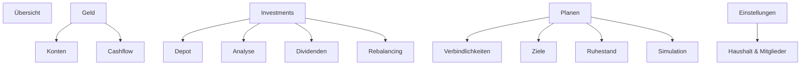
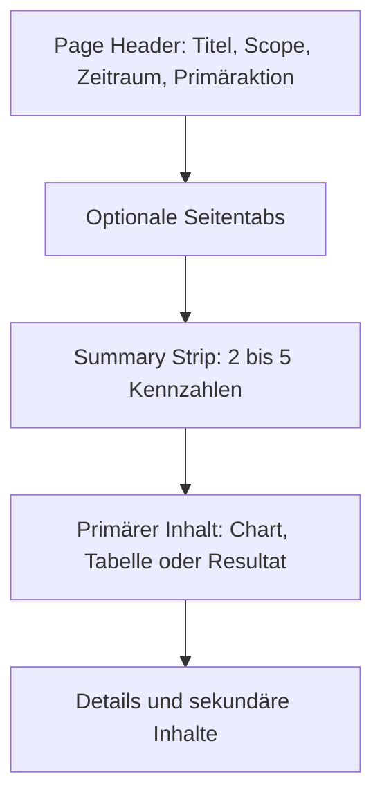
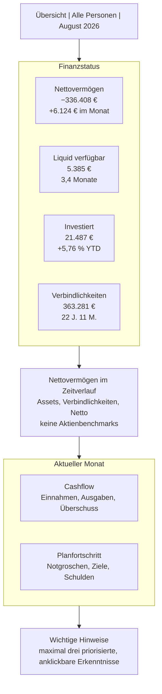
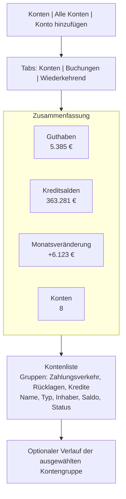
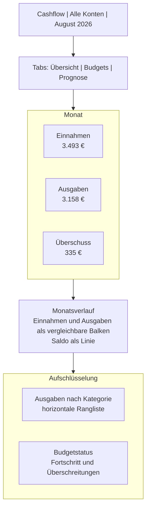
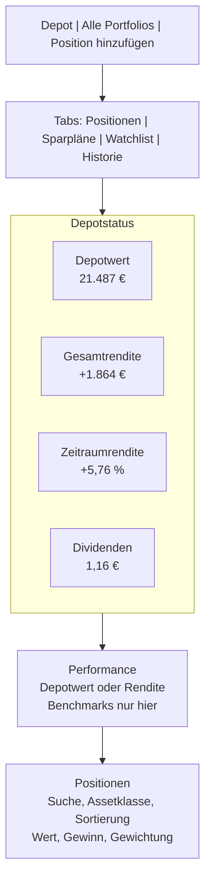
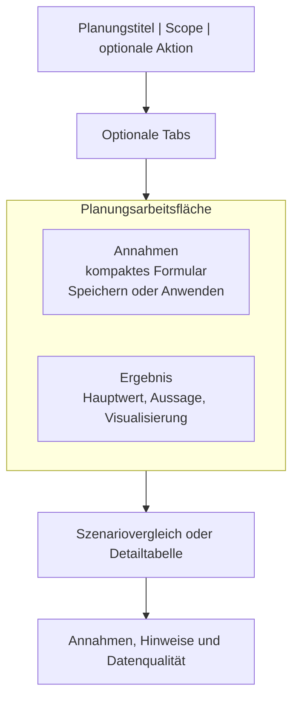

# FinTrack UX-Unification-Spec

Stand: 21. August 2026

## Auftrag an Claude Code

Vereinheitliche die bestehende FinTrack-Anwendung anhand dieser Spezifikation. Das Ziel ist keine kosmetische Überarbeitung einzelner Seiten, sondern ein gemeinsames Produktoberflächen-System für Haushaltsfinanzen, Vermögen, Investments und Planung.

Arbeite zuerst repo-weit. Suche bestehende Layouts, Tokens, wiederkehrende Komponenten, Chart-Konfigurationen, Tabellen, Formulare, Tabs, Filter und Seitentitel. Baue anschließend zentrale Primitives und migriere die Seiten auf diese Primitives. Erzeuge keine weiteren lokalen Sonderlösungen pro Route.

### Prioritäten

1. Verständliche Informationsarchitektur und klare Nutzerwege
2. Konsistente Seitenhierarchie und Interaktionsmuster
3. Lesbarkeit, Kontrast und Datendichte
4. Responsive Verhalten und Tastaturbedienung
5. Visuelle Feinheiten

### Nicht verhandelbar

- Bestehende Berechnungen, Datenmodelle und fachliche Logik bleiben erhalten, sofern diese Spezifikation nicht ausdrücklich einen semantischen Fehler nennt.
- Bestehende URLs bleiben erreichbar. Falls Routen zusammengeführt werden, nutze Redirects oder kompatible Alias-Routen.
- Keine Seite erhält eigene Farben, Radien, Abstände, Tabellenstile, Buttonstile oder Chart-Defaults.
- Keine neue Komponente, wenn dieselbe Aufgabe bereits durch ein gemeinsames Primitive abgedeckt werden kann.
- Dark und Light Mode müssen dieselben semantischen Tokens verwenden.
- Desktop, Tablet und Mobile gehören zur Definition of Done.
- Eine negative Summe ist nicht automatisch ein Fehler. Farbe transportiert Bedeutung, nicht bloß ein mathematisches Vorzeichen.
- Finanzielle Kennzahlen brauchen konsistente Begriffe, Zeitbezüge und Zahlenformate.
- Keine Feature-Erweiterung als Ersatz für saubere UX.
- Keine Code-Kommentare hinzufügen.

### Quellenhierarchie

Bei widersprüchlichen Anweisungen gilt für diese Migration folgende Reihenfolge:

1. Der aktuelle Nutzerauftrag definiert Umfang und Freigaben.
2. Diese Spezifikation definiert Ziel-UX, Informationsarchitektur, Seitenhierarchie, Interaktionsmuster und visuelle Semantik.
3. Der bestehende `styleguide`-Skill dokumentiert den aktuellen Implementierungsstand, vorhandene Primitives, Repositorypfade, Lokalisierung, Privacy-Verhalten und Paywall-Konventionen.
4. Der aktuelle Quellcode ist Beleg des Ist-Zustands, aber nicht automatisch das gewünschte Zielbild.

Der bestehende Styleguide darf eine Entscheidung dieser Spezifikation nicht still überschreiben. Ebenso darf eine konzeptionell anders benannte Zielkomponente nicht automatisch zur Neuerstellung führen, wenn ein vorhandenes Primitive sinnvoll erweitert werden kann.

### Lifecycle des bisherigen Styleguide-Skills

Der derzeitige Skill ist eine wertvolle Bestandsaufnahme, enthält aber auch Regeln, die den zu ersetzenden Zustand konservieren. Deshalb gilt:

1. In Phase 0 den vollständigen bisherigen Skill lesen und seine Aussagen gegen den tatsächlichen Code prüfen.
2. Eine Konfliktmatrix `UX-Spezifikation gegen bisherigen Styleguide` erstellen und jede Abweichung bewusst entscheiden.
3. Wiederverwendbare technische Fakten in den Migrationsplan übernehmen.
4. Nach abgeschlossenem Phase-0-Audit den alten Skill aus `.claude/skills/` entfernen oder außerhalb der aktiven Skill-Verzeichnisse als historische Referenz archivieren.
5. Während der Implementierung darf der alte Skill nicht mehr automatisch geladen werden.
6. Nach abgeschlossener Migration einen neuen, kompakten Styleguide-Skill aus dem tatsächlich implementierten und verifizierten Code generieren.
7. Der neue Skill beschreibt ausschließlich den neuen Ist-Zustand. Er darf keine überholten Klassen, Pfade oder Primitives aus dem alten Skill übernehmen.

Den alten Skill nicht vor Phase 0 löschen. Sonst gehen konkrete Hinweise auf vorhandene Helfer, Komponenten und Seiteneffekte verloren.

## 1. Zielbild des Produkts

FinTrack ist eine persönliche Finanzzentrale. Haushaltsbuch und Portfolio sind keine getrennten Produkte, sondern zwei Perspektiven auf dasselbe System:

1. **Heute:** Konten, Buchungen, Einnahmen, Ausgaben und Verbindlichkeiten
2. **Vermögen:** Depot, Rendite, Ausschüttungen, Allokation und Risiko
3. **Zukunft:** Ziele, Schuldenabbau, Ruhestand und Simulation

Jede Seite soll mindestens eine dieser Nutzerfragen eindeutig beantworten:

- Wo stehe ich gerade?
- Was hat sich verändert und warum?
- Was sollte ich als Nächstes tun?

Wenn eine Seite keine eigenständige Nutzerfrage beantwortet, gehört sie als Unteransicht, Detailseite oder Einstellung in einen größeren Bereich.

## 2. Diagnose des aktuellen Zustands

Die Screenshots zeigen bereits eine solide dunkle Grundästhetik und viele fachlich wertvolle Funktionen. Das Frankenstein-Gefühl entsteht vor allem aus Struktur und Verhalten.

### 2.1 Informationsarchitektur

- `Haushalt` ist eine Verwaltungsseite für Mitglieder, steht aber als gleichrangiger Finanzbereich in der Hauptnavigation.
- `Gesundheit` besteht nur aus vier Kennzahlen und rechtfertigt derzeit keine eigene Hauptseite.
- `X-Ray` überschneidet sich begrifflich mit `Analyse`.
- `Konten & Buchungen` enthält Konten, Wiederkehrendes und eine lange Buchungstabelle auf einer Seite. Andere Bereiche verteilen vergleichbare Unterthemen auf eigene Seiten oder Tabs.
- `Cashflow` enthält Übersicht, Prognose und Budgets gleichzeitig, obwohl dies drei unterschiedliche Aufgaben sind.
- `Depot` enthält Positionen, frühere Positionen, Sparpläne und Watchlist gleichzeitig.
- Verbindlichkeiten stehen unter `Alltag`, obwohl Tilgungsstrategie und schuldenfreies Datum primär Planung sind.

### 2.2 Seitenaufbau

- Seitenspezifische Filter erscheinen teils in der globalen Kopfleiste, teils rechts neben dem Seitentitel, teils im Kartenkopf.
- Primäraktionen wechseln ohne Regel zwischen Seitenkopf und einzelnen Karten.
- Manche KPI-Gruppen sind eine gemeinsame Fläche, andere werden in Einzelkarten aufgeteilt.
- Tabs existieren in mehreren visuellen Varianten.
- Formulare sind teils dauerhaft sichtbar, teils hinter Aktionen verborgen.
- Dichte Tabellen und sehr leere Seiten benutzen denselben großen Inhaltsrahmen ohne passende Leerezustände.

### 2.3 Semantik und Datendarstellung

- Die Übersichtsseite vergleicht das Nettovermögen inklusive Verbindlichkeiten mit Aktienindizes. Das ist fachlich und mental ein unpassender Vergleich. Benchmarks gehören ausschließlich zur Depotperformance.
- Große Bestandswerte werden allein wegen eines Minuszeichens alarmrot dargestellt. Ein Hypothekensaldo ist aber ein Bestand, kein Fehlerzustand.
- Grün dient gleichzeitig als Marke, positive Entwicklung, Diagrammserie, Einnahme und Fortschritt. Dadurch verliert Farbe ihre Bedeutung.
- `Rein`, `Raus`, `Netto`, `Cashflow`, `Veränderung` und `Saldo` werden nicht durchgehend gleich verwendet.
- Zeiträume und Periodensteuerung sind inkonsistent: Kalendernavigation, Dropdowns und Range-Chips konkurrieren miteinander.

### 2.4 Lesbarkeit

- Sekundärtexte, Achsen, Tabellenköpfe und Erläuterungen sind zu klein und zu kontrastarm.
- Auf breiten Screens entsteht hohe horizontale Datendichte, während unter dem Inhalt sehr viel leere Fläche bleibt.
- Tabellenaktionen bestehen teilweise nur aus sehr kleinen, unbeschrifteten Icons.
- Fast jede Gruppe liegt in einer umrandeten Karte. Die Hierarchie wird dadurch flach, weil alles gleich wichtig wirkt.

## 3. Neue Informationsarchitektur

### 3.1 Primärnavigation



### 3.2 Migration der bestehenden Navigation

| Bisher | Ziel | Entscheidung |
| --- | --- | --- |
| Übersicht | Übersicht | Bleibt Startseite |
| Konten & Buchungen | Geld > Konten | Untertabs `Konten`, `Buchungen`, `Wiederkehrend` |
| Cashflow | Geld > Cashflow | Untertabs `Übersicht`, `Budgets`, `Prognose` |
| Verbindlichkeiten | Planen > Verbindlichkeiten | Aus `Alltag` verschieben |
| Haushalt | Einstellungen > Haushalt & Mitglieder | Aus der Kernnavigation entfernen |
| Depot | Investments > Depot | Untertabs `Positionen`, `Sparpläne`, `Watchlist`, `Historie` |
| Analyse | Investments > Analyse | `X-Ray` als Untertab integrieren, falls fachlich deckungsgleich |
| Dividenden | Investments > Dividenden | Bleibt eigenständiger Workflow |
| X-Ray | Investments > Analyse > X-Ray | Keine gleichrangige Hauptnavigation |
| Rebalancing | Investments > Rebalancing | Bleibt eigenständiger Workflow |
| Ziele | Planen > Ziele | Bleibt |
| Ruhestand | Planen > Ruhestand | Untertabs `FIRE`, `Rente` |
| Gesundheit | Übersicht > Finanzielle Gesundheit | Aus Hauptnavigation entfernen, Detailroute darf bestehen |
| Simulation | Planen > Simulation | Bleibt |

### 3.3 Navigationsregeln

- Maximal vier sichtbare Domänengruppen plus Übersicht.
- Verwaltungsfunktionen stehen unten bei Profil und Einstellungen.
- Der aktive Eintrag zeigt Fläche, Textkontrast und einen schmalen Akzent. Farbe allein reicht nicht.
- Eingeklappte Navigation zeigt Tooltips für jedes Icon.
- Unteransichten werden als Tabs innerhalb der Seite dargestellt, nicht als zusätzliche Sidebar-Einträge.
- Breadcrumbs werden nur auf echten Detailseiten verwendet, nicht auf jeder Hauptseite.

## 4. Einheitliches App-Shell

### 4.1 Desktop

- Sidebar: 240 px breit, fixiert, selbstständig scrollbar
- Global Bar: 56 px hoch
- Inhalt: maximal 1480 px breit, links und rechts automatisch zentriert
- Seitenabstand: 32 px horizontal und 28 px vertikal
- Global Bar enthält nur globale Aktionen: Privacy-Modus, Theme, Profil
- Konto-, Portfolio- und Zeitraumfilter gehören in den jeweiligen Page Header
- Der Footer sitzt nach dem Inhalt, aber die Seite füllt mindestens die verfügbare Höhe

### 4.2 Tablet

- Zwischen 768 und 1199 px wird die Sidebar zu einer 64 px breiten Icon-Rail.
- Der Inhalt erhält 24 px horizontalen Abstand.
- Page-Header-Aktionen dürfen in eine zweite Zeile umbrechen.
- KPI-Leisten werden zweispaltig, nicht horizontal scrollbar.

### 4.3 Mobile

- Unter 768 px gibt es eine 56 px hohe mobile Kopfleiste und einen Drawer für die vollständige Navigation.
- Die vier Hauptbereiche können optional als Bottom Navigation erscheinen: Übersicht, Geld, Investments, Planen. Einstellungen bleiben im Drawer oder Profilmenü.
- Inhalt hat 16 px horizontalen Abstand.
- Karten und Formulare sind einspaltig.
- Tabellen wechseln entweder zu priorisierten Zeilenkarten oder erhalten einen klar erkennbaren horizontalen Scroll-Container. Kerninformationen dürfen nie außerhalb des Viewports beginnen.
- Primäraktionen bleiben sichtbar, dürfen aber keine Daten verdecken.

## 5. Design Tokens

Implementiere semantische Tokens zentral in der vorhandenen Tailwind-v4- und `app/globals.css`-Struktur. FinTrack schaltet Dark Mode über die Klasse `.dark` auf `<html>`. Behalte diesen Mechanismus bei. Keine Hex-Farben in JSX oder einzelnen Seiten. Die Werte sind Zielwerte, dürfen nach einer Kontrastprüfung geringfügig angepasst werden. Die Trennung der Rollen ist verbindlich.

```css
:root {
  --color-bg-app: #f5f7f8;
  --color-bg-sidebar: #f8fafb;
  --color-surface: #ffffff;
  --color-surface-elevated: #ffffff;
  --color-surface-hover: #f0f3f5;
  --color-border-subtle: #dde2e7;
  --color-border-strong: #c8d0d8;
  --color-text-primary: #14171a;
  --color-text-secondary: #4d5966;
  --color-text-tertiary: #6b7682;
  --color-brand: #087a73;
  --color-brand-hover: #06665f;
  --color-positive: #177a45;
  --color-negative: #c9364a;
  --color-warning: #96620a;
  --color-info: #1d64b7;
  --color-action-primary-bg: #18181b;
  --color-action-primary-fg: #ffffff;
  --color-chart-1: #5364d8;
  --color-chart-2: #1689a5;
  --color-chart-3: #7b50c7;
  --color-chart-4: #a96b0b;
  --color-chart-5: #a64a82;
  --color-chart-6: #647286;
}

.dark {
  --color-bg-app: #090b0e;
  --color-bg-sidebar: #0d0f13;
  --color-surface: #14171c;
  --color-surface-elevated: #181c22;
  --color-surface-hover: #1e232b;
  --color-border-subtle: #2a3039;
  --color-border-strong: #3a424d;
  --color-text-primary: #f4f6f8;
  --color-text-secondary: #a8b0bc;
  --color-text-tertiary: #8b95a3;
  --color-brand: #2fc7b5;
  --color-brand-hover: #42d5c3;
  --color-positive: #45d483;
  --color-negative: #ff6b7a;
  --color-warning: #f2b84b;
  --color-info: #6ea8fe;
  --color-action-primary-bg: #f4f4f5;
  --color-action-primary-fg: #18181b;
  --color-chart-1: #6f7bf7;
  --color-chart-2: #34b7d6;
  --color-chart-3: #a87ff2;
  --color-chart-4: #e7a94b;
  --color-chart-5: #d874b6;
  --color-chart-6: #8b97a8;
}
```

### 5.1 Abstände und Geometrie

| Token | Wert | Verwendung |
| --- | ---: | --- |
| space-1 | 4 px | Icon-Abstand, Mikroabstand |
| space-2 | 8 px | Inline-Gruppen |
| space-3 | 12 px | Kompakte Controls |
| space-4 | 16 px | Mobile Padding, Zeilen |
| space-5 | 24 px | Karten-Padding, Abschnittsabstand |
| space-6 | 32 px | Desktop Page Padding |
| space-7 | 48 px | Große Abschnittstrennung |
| radius-control | 6 px | Inputs, Buttons, Chips |
| radius-surface | 10 px | Karten und Dialoge |
| border | 1 px | Alle statischen Grenzen |

- Keine dekorativen Schatten im Dark Mode.
- Im Light Mode höchstens ein sehr subtiler Schatten für Popover und Dialoge.
- Flächen werden primär über Hintergrund und Border getrennt, nicht über mehrere verschachtelte Karten.

### 5.2 Typografie

Behalte `Geist Sans` als UI-Schrift und `Geist Mono` für technische Identifikatoren. Geldwerte verwenden tabellarische Ziffern in der UI-Schrift, nicht automatisch Monospace.

| Rolle | Größe / Zeilenhöhe | Gewicht |
| --- | --- | --- |
| Page title | 24 / 32 px | 650 |
| Section title | 16 / 24 px | 600 |
| Card title | 14 / 20 px | 600 |
| KPI value | 24 / 30 px | 650 |
| Body | 14 / 21 px | 400 |
| Label | 13 / 18 px | 500 |
| Supporting text | 12 / 18 px | 400 |
| Table header | 12 / 16 px | 600 |

- Verwende tabellarische Ziffern für Geldwerte, Prozentwerte, Datumswerte und Tabellen.
- Kein essenzieller Text unter 12 px.
- Großbuchstaben nur für sehr kurze Tabellenköpfe oder Navigationsgruppen.
- Hilfetext darf kleiner, aber nie kontrastarm bis unlesbar sein.

## 6. Semantische Farbe

### 6.1 Verbindliche Regeln

- Brand-Farbe: aktiver Zustand, Fokus, primäre Auswahl und Links
- Primäraktion: neutrale, maximal kontrastreiche Fläche mit dem `action-primary`-Token
- Positiv: tatsächliche Verbesserung oder bestätigter Zufluss
- Negativ: tatsächliche Verschlechterung, Verlust, Überschreitung, Fehler oder destruktive Aktion
- Warnung: Aufmerksamkeit erforderlich, aber kein Fehler
- Chart-Farben: neutrale Kategorien und Serien

### 6.2 Konkrete Beispiele

- `363.280,63 € Verbindlichkeiten` ist als Bestandswert zunächst weiß. Ein Anstieg um `+2.000 €` ist rot.
- `−336.408,28 € Nettovermögen` ist als aktueller Hauptwert zunächst weiß. Die Veränderung zum Vorzeitraum erhält semantische Farbe.
- Einnahmen können positivgrün sein, wenn Zufluss die Aussage ist.
- Ausgaben werden nicht pauschal alarmrot. Normal geplante Ausgaben sind neutral oder als Chart-Serie codiert. Rot wird bei Budgetüberschreitung verwendet.
- Rot und Grün dürfen nicht als beliebige Portfoliokategorien eingesetzt werden.
- Brand-Teal und Positiv-Grün müssen als unterschiedliche semantische Rollen implementiert sein, auch wenn beide zur grün-blauen Farbfamilie gehören.

## 7. Gemeinsame Komponenten

Claude soll vorhandene Komponenten zusammenführen oder folgende Primitives neu schaffen. Die Namen sind beispielhaft, die Rollen nicht.

Vorhandene Primitives werden zuerst auf ihre Eignung geprüft. `PageHeader`, `SectionTitle`, `Stat`, `StatRow`, `Button`, `SegmentedControl`, `Tabs`, `SelectMenu`, `MonthPicker`, `FormActions`, die Tabellenprimitives, `Skeleton`, `EmptyState`, `LoadError`, `ConfirmDialog`, `Modal`, `InfoTip`, `Toggle`, `Slider`, `ProTeaser` und `ProGate` sind bekannte Ausgangspunkte. Ihre Existenz ist kein Beweis, dass ihre aktuelle Darstellung oder API unverändert bleiben muss.

### 7.1 `PageHeader`

Enthält:

- Titel
- eine kurze, nutzerorientierte Beschreibung
- optional primäre Tabs direkt darunter
- rechts: Scope-Selector, Periodensteuerung, eine Primäraktion

Reihenfolge rechts:

1. Scope
2. Zeitraum
3. sekundäre Aktion
4. primäre Aktion

Auf Mobile werden Titel und Beschreibung zuerst gezeigt, Controls darunter als umbrechende Gruppe.

### 7.2 `SummaryStrip`

- Eine gemeinsame Fläche mit zwei bis maximal fünf Kennzahlen
- Jede Kennzahl hat Label, Hauptwert und optional eine Kontextzeile
- Einheitliche Mindesthöhe und Innenabstände
- Trennlinien zwischen Kennzahlen auf Desktop, horizontale Trennlinien auf Mobile
- Kein zusätzlicher Kartenrahmen pro Kennzahl

### 7.3 `Section`

- Optionaler Titel, Beschreibung und Actionslot
- Standard-Padding 24 px
- Kein verschachtelter Kartenrahmen
- Diagramm, Tabelle oder Formular beginnt nach 20 bis 24 px Abstand
- Abschnitte ohne nötige Begrenzung bleiben rahmenlos

### 7.4 `Tabs`

- Primäre Seitentabs: Linie unter dem aktiven Tab
- Sekundäre Ansichtsumschaltung: kompakte Segmented Control
- Keine dritte Tab-Variante
- Aktiver Zustand nutzt nicht nur Farbe, sondern auch Fläche oder Linie

### 7.5 `Button`

- Primary: genau eine Hauptaktion pro sichtbarem Kontext
- Primary bleibt neutral und maximal kontrastreich. Die Brand-Farbe wird nicht zusätzlich als CTA-Füllfarbe verwendet.
- Secondary: normale Aktion mit Border
- Ghost: Toolbar- und Zeilenaktion
- Destructive: nur Löschen, Verlassen, Entfernen
- Icon-only nur für universell erkennbare Aktionen und immer mit Tooltip sowie Accessible Name
- Mindesthöhe 36 px Desktop, 40 px Mobile

### 7.6 `Field`

- Label immer oberhalb des Inputs
- Beschreibung oder Validierung direkt darunter
- Einheitliche Höhe 36 px Desktop, 40 px Mobile
- Einheitliche Focus-Ring-Farbe
- Focus darf nicht nur durch eine geringfügig andere Border-Farbe sichtbar werden. Nutze einen klaren `focus-visible` Ring mit ausreichendem Kontrast.
- Einheitliche Darstellung für Select, Datum, Betrag, Slider und Switch
- Einheiten wie EUR oder % stehen als Suffix im Feld, nicht als zufälliger Text daneben
- Pflichtfelder dürfen beim Tippen ruhig bleiben. Validiere nach Blur oder nach einem Submit-Versuch und zeige eine konkrete Meldung am Feld.

### 7.7 `DataTable`

- Zeilenhöhe mindestens 44 px, bei zweizeiligem Inhalt 52 px
- Name oder Primärinformation links, Zahlen rechts
- Sortierbare Spalten zeigen ein klares Icon und korrektes `aria-sort`
- Nicht jede Tabelle muss sortierbar sein. Aktiviere Sortierung nur, wenn die Reihenfolge für die Nutzeraufgabe relevant ist.
- Hover-Zustand über die komplette Zeile
- Zeilenaktionen in einem Menü `Mehr`, wenn mehr als zwei Aktionen existieren
- Wichtige Aktion darf direkt sichtbar bleiben, destruktive Aktion nie ohne Bestätigung
- Mobile priorisiert drei Werte: Name, wichtigster Betrag, Status oder Veränderung

### 7.8 `ChartCard`

- Titel und Beschreibung links
- Zeitraum, Darstellungsart und Vergleich rechts
- Plot-Höhe 280 bis 340 px Desktop, mindestens 220 px Mobile
- Legende konsistent unter dem Plot oder rechts, nicht wechselnd
- Gridlines subtil, Achsen gut lesbar
- Tooltips zeigen Datum, Wert, Serie und gegebenenfalls Veränderung
- Lade-, Leer- und Fehlerzustand haben dieselbe Höhe wie der Plot, um Layoutsprünge zu vermeiden

### 7.9 `EmptyState`

Enthält:

- klare Aussage, warum nichts zu sehen ist
- ein Satz, welchen Nutzen das Hinzufügen von Daten hat
- genau eine primäre Aktion
- optional ein dezenter Link zu Hilfe oder Import

Nicht gleichzeitig ein dauerhaft sichtbares leeres Formular zeigen.

### 7.10 `InlineNotice`

Für fachliche Hinweise, Annahmen und Warnungen. Varianten: info, success, warning, error. Keine frei erfundenen orangefarbenen Spezialboxen pro Seite.

### 7.11 Statusmarker und Badges

- Keine dekorativen, gefüllten Badges für beliebige Metadaten.
- Semantisch notwendige Marker wie `geschätzt`, `überfällig`, `Pro` oder eine Benachrichtigungsanzahl sind erlaubt.
- Marker verwenden Text plus Form oder Icon und verlassen sich nicht allein auf Farbe.
- Prüfe den bestehenden `EstimatedBadge`. Behalte die Semantik, vereinheitliche aber Name und Darstellung mit dem neuen Statusmarker-Primitive.
- `SegmentedControl` ist ein interaktives Control und kein Badge.

### 7.12 Icons

- Behalte die bestehende Inline-SVG-Strategie, wenn Icons zentral wiederverwendet werden.
- Keine SVG-Pfade auf mehreren Seiten duplizieren. Gemeinsame Icons als Komponenten kapseln.
- Icons verwenden `currentColor`, ein konsistentes Stroke-Gewicht und dieselben Größenstufen.
- Keine neue Icon-Bibliothek ausschließlich für diese Migration einführen.

## 8. Einheitliches Seiten-Template

Jede Hauptseite folgt derselben vertikalen Reihenfolge:

1. `PageHeader`
2. optionale primäre Tabs
3. `SummaryStrip`
4. primäre Visualisierung oder Hauptaufgabe
5. Detaildaten
6. sekundäre Konfiguration oder weiterführende Inhalte

Nicht jede Seite braucht alle sechs Ebenen. Die Reihenfolge bleibt aber stabil.



## 9. Mockup: Neue Übersicht

Die Übersicht ist kein zweites Depot-Dashboard. Sie erzählt die Gesamtgeschichte aus Bestand, Bewegung und Fortschritt.



### Regeln für die Übersicht

- Entferne Benchmark-Chips und Renditekennzahlen aus dem Nettovermögenschart.
- Zeige im Chart getrennt Assets, Verbindlichkeiten und Netto. Der Nutzer muss die negative Gesamtsumme verstehen können.
- Nutze als Hauptzeitraum den im Page Header gewählten Zeitraum.
- Ersetze `Rein`, `Raus`, `Noch fällig` durch `Einnahmen`, `Ausgaben`, `Noch ausstehend`.
- Die Sparquote gehört in den Monatskontext oder in `Finanzielle Gesundheit`, nicht mehrfach in verschiedene KPI-Reihen.
- `Finanzielle Gesundheit` wird als kompakter, anklickbarer Abschnitt integriert. Die vier Kennzahlen können bestehen bleiben, aber nicht als eigene leere Hauptseite.
- Ziele zeigen maximal drei Einträge und einen Link `Alle Ziele`.
- Erkenntnisse werden nur aus vorhandenen Daten gebildet. Keine generischen Motivationskarten.

## 10. Mockup: Geldbereich

### 10.1 Konten



### Regeln für Konten

- Der große negative Nettowert darf nicht allein die Seite dominieren.
- Gruppiere Konten nach ihrem mentalen Zweck, nicht nur als flache Tabelle.
- Zeige Zins und Gutschrift unter dem Kontonamen weiterhin als Sekundärzeile.
- Verschiebe die Buchungstabelle in den Tab `Buchungen`.
- Verschiebe den Accordion-Inhalt in den Tab `Wiederkehrend`.
- Der Account-Selector steht im Page Header, nicht in der Global Bar.
- Monatsnavigation steht im Page Header und verwendet auf allen Geldseiten dieselbe Komponente.

### 10.2 Buchungen

- Oberhalb der Tabelle: Suchfeld, Zeitraum, Konto, Kategorie, Status und `Buchung hinzufügen`.
- Seltene Aktionen wie Import und automatische Kategorisierung liegen in einem Menü `Mehr`.
- `Kategorien verwalten` ist ein Link oder eine sekundäre Aktion, nicht gleichrangig mit `Buchung hinzufügen`.
- Tabellenreihenfolge: Datum, Empfänger, Konto, Kategorie, Person, Betrag, Aktionen.
- Zahler und Empfänger werden nicht gleichzeitig gezeigt, wenn eine einzige Gegenpartei fachlich genügt.
- Wiederkehrende Buchung erhält ein sichtbares, aber dezentes Icon mit Tooltip.
- Pagination zeigt `1–25 von 42`, Seite und Vor/Weiter in einem gemeinsamen Footer.

### 10.3 Cashflow



### Regeln für Cashflow

- Der Sankey ist nicht die primäre Standardvisualisierung. Für Haushaltsausgaben sind sortierte horizontale Balken schneller vergleichbar.
- Ein Sankey darf als alternative Ansicht `Geldfluss` erhalten bleiben.
- Budgets erhalten eine eigene Unteransicht. Bei null Budgets erscheint ein Empty State mit `Erstes Budget anlegen`.
- Prognose erhält eine eigene Unteransicht und zeigt klar `geplant`, `bereits gebucht` und `kumuliert`.
- Ausgaben sind neutral codiert. Nur Überschreitungen oder negative Abweichungen sind rot.

## 11. Mockup: Investmentbereich

### 11.1 Depot



### Regeln für Depot

- Kombiniere `nicht realisiert` und `realisiert` nicht wahllos mit Zeitraumrendite. Benenne jeden Wert eindeutig und zeige seine Bezugsperiode.
- `Linear`, `Logarithmisch`, `Vermögen`, `Rendite` werden als zwei beschriftete Segmented Controls dargestellt, nicht als lose Chips.
- Benchmarks werden über `Vergleichen mit` verwaltet und nur im Investmentkontext angeboten.
- Sparpläne, Watchlist und frühere Positionen werden nicht unter der Positionsliste gestapelt, sondern in Untertabs verschoben.
- Filterchips für Assetklassen sind konsistent mit den Analysefiltern.
- Gewichtung nutzt eine neutrale Progressbar. Gewinn und Verlust bleiben als Textwert semantisch gefärbt.

### 11.2 Analyse und X-Ray

- Primärtabs: `Verteilung`, `Rendite`, `Trades`, `Risiko`, `Steuern`, `X-Ray`.
- Sekundäre Dimensionen innerhalb von `Verteilung`: Investments, Anlageklassen, Sektoren, Regionen, Länder, Währungen.
- Donut und Legende bilden eine gemeinsame Visualisierung. Legendenzeilen sind anklickbar und können eine Serie hervorheben, aber nicht verstecken, wenn dies die Gesamtsumme verfälscht.
- Auf breiten Screens steht die Legende rechts, auf Mobile unter dem Chart.
- Wenn nur eine Visualisierung vorhanden ist, bleibt die Seite bewusst kompakt. Keine leeren Karten hinzufügen, nur um Fläche zu füllen.

### 11.3 Dividenden

- Summary Strip: letzte 12 Monate, gesamt, Dividendenrendite, Yield on Cost.
- Zeitraumumschaltung sitzt im Chart Header.
- `Anstehende Dividenden` und `Nach Position` nutzen dasselbe Tabellenprimitive wie das Depot.
- Prognosen werden als Prognose markiert. Bestätigte Zahlungen und erwartete Zahlungen müssen visuell unterscheidbar sein.

### 11.4 Rebalancing

- Ersetze die zwei fast identischen Donuts nach Möglichkeit durch eine Abweichungsansicht.
- Bevorzugt: horizontale Balken je Position mit `Ist`, `Ziel` und `Differenz`.
- Trade-Vorschläge stehen in derselben Zeile und verwenden `Kaufen` oder `Verkaufen` als Text plus Betrag.
- Der Gesamtwert wird nur einmal gezeigt.
- `Auf 100 % normalisieren` ist eine sekundäre Aktion am Zielbereich.
- `Kaufen & Verkaufen` und `Nur kaufen` sind ein einheitliches Segmented Control.

## 12. Mockup: Planung

Planungsseiten folgen einem gemeinsamen Muster: Annahmen links oder oben, Ergebnis prominent, Details darunter.



### 12.1 Verbindlichkeiten

- Summary Strip: offene Verbindlichkeiten, Mindestzahlung, schuldenfrei am, verbleibende Zinsen.
- `22 Jahre, 11 Monate` erhält zusätzlich das konkrete Datum, aber nicht als kaum lesbare Unterzeile.
- Strategie, Zusatzrate und Filter liegen in einem kompakten Bereich `Plan anpassen`.
- Sondertilgungen werden über `Sondertilgung hinzufügen` in Dialog oder Drawer eingegeben, nicht als dauerhaft leere Formularzeile.
- Hauptchart zeigt Restschuld im Zeitverlauf.
- Die Schuldentabelle nutzt neutrale Bestandswerte. Nur problematische Änderung oder überfällige Rate ist rot.
- Zins und Tilgung pro Jahr bleibt sekundär unter der Tabelle.

### 12.2 Ruhestand

- `FIRE` und `Rente` bleiben primäre Tabs derselben Seite.
- Beide Tabs nutzen dasselbe Raster, dieselben Feldkomponenten und denselben Resultatstil.
- Annahmen und Ergebnisse werden klar getrennt.
- Statusaussagen wie `Ziel nicht erreichbar` dürfen nicht als kleine gelbe Textzeile unter jeder Karte versteckt werden. Nutze einen gemeinsamen Warning Notice mit Ursache und nächster Stellschraube.
- Drei FIRE-Varianten bleiben vergleichbar, erhalten aber gleiche Informationsreihenfolge: Zielvermögen, benötigte Sparrate, Zieljahr, Status.
- In `Rente` werden Entgeltpunkte und Verträge als Dateneingabe-Abschnitte behandelt. Die Zusammenfassung steht davor.

### 12.3 Simulation

- Desktop: Parameterpanel 360 bis 400 px, Ergebnis nimmt den restlichen Raum ein.
- Das Parameterpanel darf beim Scrollen innerhalb der Inhaltsfläche sticky sein.
- Vor dem Start zeigt der Ergebnisbereich einen echten Empty State: kurzer Nutzen, benötigte Schritte, keine riesige leere Fläche.
- Nach dem Start zeigt der Ergebnisbereich zuerst die Bandbreite der Projektion, danach Kennzahlen und Szenariodetails.
- `Wert eingeben` ist keine lose Textaktion neben einem Slider. Verwende ein verbundenes Zahlenfeld oder öffne einen klaren Popover.
- Modellannahmen werden mit demselben `InlineNotice` dargestellt wie andere fachliche Hinweise.
- `Simulation starten` ist die einzige primäre Aktion im Parameterpanel.

### 12.4 Ziele

- Wende dieselbe Summary- und Section-Struktur an, auch wenn die Seite nicht in den Screenshots enthalten ist.
- Zielkarten zeigen Name, Zielbetrag, aktueller Betrag, Zieltermin, Fortschritt und Status in identischer Reihenfolge.
- Fortschrittsfarbe ist Brand oder neutral. Warnung erst bei tatsächlicher Abweichung vom Plan.

## 13. Einstellungen

Einstellungen sind ein eigener Verwaltungsbereich und keine schmale Nebenansicht. Sie verwenden dieselben Tokens, Tabs, Formfelder, Buttons und Zustände wie die fachlichen Seiten, benötigen aber keine Finanzkennzahlen.

### 13.1 Informationsarchitektur und Layout

- Zugriff über Profilmenü oder Avatar. Kein zusätzlicher permanenter Hauptnavigationseintrag nötig.
- Tabs: `Allgemein`, `Haushalt`, `Steuern & Gebühren`, `KI-Assistent`.
- Der Page Header beschreibt den gesamten Bereich, nicht nur Profil und Sprache. Geeignete Copy: `Verwalte dein Konto, deinen Haushalt und appweite Vorgaben.`
- Settings verwenden einen mittleren Content-Container von ungefähr 720 bis 800 px. Die aktuelle sehr schmale Spalte wirkt im breiten App-Shell wie ein Fremdkörper.
- Formulare bleiben gut scanbar. Ein Feld darf die volle Breite nutzen, verwandte kurze Felder können in zwei Spalten stehen.
- Unter 720 px wechseln alle Formulargruppen kontrolliert in eine Spalte.
- Keine künstliche zweite Spalte und keine leeren Karten zum Auffüllen kurzer Seiten.
- Tabs sind auf Mobile horizontal scrollbar und behalten verständliche vollständige Labels.

### 13.2 Gemeinsames Speichern-Muster

Jede Settings-Fläche entscheidet sich bewusst für genau eines dieser Muster:

1. explizites Speichern pro unabhängiger Karte
2. automatisches Speichern mit sichtbarer Statusrückmeldung
3. ein gemeinsamer Formularabschluss für einen zusammenhängenden Flow

Verbindliche Regeln:

- Kein Abschnitt darf unklar lassen, ob eine Änderung bereits übernommen wurde.
- `Speichern` ist deaktiviert, solange sich nichts geändert hat oder das Formular ungültig ist.
- Nach Erfolg erscheint eine unaufdringliche Rückmeldung `Gespeichert` am Abschnitt.
- Fehler erscheinen direkt am betroffenen Feld und zusätzlich in einer kurzen Abschnittszusammenfassung, falls mehrere Felder betroffen sind.
- Tabwechsel, Providerwechsel, Brokerwechsel und Navigation mit ungespeicherten Änderungen benötigen Bestätigung oder verlässliches Autosave.
- Sprache darf sofort übernommen werden, muss dann aber einen klaren gespeicherten Zustand zeigen.
- Buttons stehen an derselben Stelle, bevorzugt unten rechts innerhalb einer Formularfläche.

### 13.3 Allgemein

Ordne die Inhalte in nachvollziehbare Bereiche:

- `Abo`
- `Profil & Sprache`
- `Benachrichtigungen`
- `Sicherheit`
- `Gefahrenzone`

Regeln:

- Vermeide eine lange Folge gleichgewichteter Einzelkarten für sehr kleine Einstellungen. Zusammengehörige Themen dürfen in einer Settings-Fläche mit internen Unterabschnitten stehen.
- Die geführte Tour ist eine sekundäre Hilfeaktion und darf visuell nicht so viel Gewicht wie Profil oder Sicherheit erhalten.
- Passwortänderung benötigt eine erneute Authentifizierung oder das aktuelle Passwort, sofern der Auth-Provider dies nicht bereits verlässlich erzwingt.
- Fehlermeldungen für Passwortregeln stehen direkt am Feld. Bestätigung wird bereits während der Eingabe abgeglichen.
- Die Gefahrenzone bleibt als eigene, klar abgesetzte Fläche am Ende.
- Bestätigungstext für Kontolöschung wird lokalisiert. In Deutsch beispielsweise `KONTO LÖSCHEN`, nicht das englische `delete`.
- Kontolöschung benötigt eine Zusammenfassung der Folgen, erneute Authentifizierung, exakten Bestätigungstext und einen finalen ConfirmDialog.
- Benachrichtigungen zeigen den echten Gerätezustand: `Aktiv`, `Nicht aktiviert`, `Im Browser blockiert` oder `Nicht unterstützt`.
- Eine Aktivierungsaktion fordert Browserberechtigung erst als direkte Folge einer Nutzeraktion an.
- Benachrichtigungsarten und Geräteberechtigung werden visuell und fachlich getrennt. Kein doppelter verschachtelter Abschnittstitel.

### 13.4 Haushalt & Mitglieder

- Verschiebe die Seite aus der Finanznavigation in Einstellungen.
- Verwende einen normalen Settings-Header ohne Finanzkennzahlen.
- Eine Fläche `Haushalt` zeigt Name, Tarif oder Sitzplätze und die Mitgliederliste.
- Rollen werden geschlechtsneutral und konsistent bezeichnet, beispielsweise `Eigentümer:in`, `Mitglied` oder `Verwaltet den Haushalt`.
- `Haushalt verlassen` und `Entfernen` sind destruktive Aktionen mit Bestätigung und verständlicher Auswirkung auf Datenzugriff.
- Eigentümer:innen dürfen einen Haushalt nicht verlassen, bevor Eigentum übertragen oder der Haushalt ordnungsgemäß aufgelöst wurde.
- Einladung erfolgt über eine klar beschriftete Primäraktion. Das Eingabefeld darf inline bleiben, wenn dies im bestehenden Flow bewährt ist.
- Ist das enthaltene Sitzplatzlimit erreicht, darf `Einladen` nicht still einen kostenpflichtigen Sitz erzeugen.
- In diesem Zustand entweder Einladung deaktivieren und zuerst den Sitzplatzkauf verlangen oder vor der kostenpflichtigen Einladung Preis und Abrechnungsintervall ausdrücklich bestätigen lassen.
- Offene Einladungen zählen nachvollziehbar gegen das Limit oder werden separat erklärt.
- Preisangaben nennen immer das Intervall, beispielsweise `1,99 € pro Monat`.
- Tarifhinweis und `Pro-Pläne ansehen` stehen als sekundäre Information unter der Sitzplatzanzeige.
- Die Seite darf kurz sein. Keine zusätzlichen leeren Karten erzeugen.

### 13.5 Steuern & Gebühren

- `Sparer-Pauschbetrag` ist eine globale steuerliche Annahme. Der zugehörige Familien- oder Veranlagungsstatus muss aus Bezeichnung, Auswahl oder Erklärung hervorgehen.
- `Freistellungsauftrag` ist brokerbezogen. Zeige zusätzlich den bereits verteilten und noch verfügbaren Betrag.
- Die Summe der Freistellungsaufträge darf den globalen Betrag nicht unbemerkt überschreiten. Zeige Inline-Validierung mit konkretem Rest- oder Überschreitungsbetrag.
- Geldfelder verwenden das gemeinsame CurrencyField mit Suffix und ohne sichtbare native Browser-Spinner.
- Steuer- und Gebührenfelder besitzen sinnvolle Min-/Max-Werte sowie lokalisierte Dezimalverarbeitung.
- Beim Wechsel des Brokers dürfen ungespeicherte Änderungen nicht verloren gehen.
- `Kostenlos ab` erklärt eindeutig, welche Gebührenregel ab dem Schwellenwert entfällt.
- `Inhaber:in` verwendet dieselben Haushaltsrollen wie Konten, Depots und Verträge.
- Die globale Checkbox `Teilfreistellung` ist fachlich zu prüfen. Teilfreistellung hängt in Deutschland von der Fondsart und den Voraussetzungen des jeweiligen Wertpapiers ab. Keine globale Aktivierung auf alle Fonds anwenden, wenn die Berechnungslogik dies nicht korrekt differenziert.
- Fachliche Steuerlogik nicht aufgrund dieser UX-Anforderung still ändern. Konflikt dokumentieren und vor Implementierung klären.

### 13.6 KI-Assistent

- Provider, Modell, API-Schlüssel und Speicherort bilden einen zusammenhängenden Einrichtungsflow.
- Das Modellfeld hängt vom gewählten Provider ab. Bei Providerwechsel muss ein ungültiges Modell sichtbar zurückgesetzt oder neu gewählt werden.
- Nach dem Speichern wird ein API-Schlüssel niemals vollständig wieder angezeigt. Zeige höchstens Maskierung und letzte vier Zeichen mit Aktion `Schlüssel ersetzen`.
- `Anzeigen` darf nur den gerade eingegebenen, noch nicht gespeicherten Wert temporär sichtbar machen.
- `In deinem Konto` und `Nur in diesem Browser` werden nicht als winzige Segmente mit langen Texten dargestellt. Verwende Radio Cards oder Radio Rows mit Titel und kurzer Konsequenz.
- Beschreibe den Speicherort sachlich. `Nur in diesem Browser` ist gerätegebunden, aber nicht automatisch sicherer gegen kompromittierten Browsercode.
- Kontospeicherung setzt serverseitige Verschlüsselung, Secret-Redaction in Logs und Zugriff nur über den vorgesehenen Backendpfad voraus.
- `Verbindung testen` sendet nur die technisch minimal erforderliche Testanfrage und keine Portfolio- oder Haushaltsdaten.
- Testergebnis erscheint inline mit Status, verständlichem Fehler und möglicher Lösung.
- `Schlüssel entfernen` ist eine sekundär-destruktive Aktion mit Bestätigung. Das Entfernen des Schlüssels löscht keine Finanzdaten.
- Erkläre vor Aktivierung, welche Daten an den Anbieter gesendet werden können, wann eine Anfrage ausgelöst wird und dass keine Anlageberatung erfolgt.
- Datenschutzlink und Anbieterhinweis müssen per Tastatur erreichbar und ausreichend kontrastreich sein.

## 14. Zahlen, Begriffe und Microcopy

### 14.1 Zahlenformat

- Währung: `21.487,46 €`
- Negative Währung: `−336.408,28 €`
- Prozent: `+5,76 %`
- Datum kurz: `19.08.2026`
- Datum ausgeschrieben, wenn Orientierung wichtiger ist: `19. August 2026`
- Dauer: `22 Jahre, 11 Monate`
- Unbekannt: `–`, nicht `0`, wenn null fachlich eine andere Bedeutung hätte

### 14.2 Verbindliche Begriffe

| Vermeiden | Verwenden |
| --- | --- |
| Rein | Einnahmen |
| Raus | Ausgaben |
| Netto, wenn Monatsfluss gemeint ist | Überschuss oder Fehlbetrag |
| Netto über alle Konten | Kontensaldo oder Nettovermögen, fachlich passend |
| Veränderung ohne Zeitraum | Veränderung im gewählten Zeitraum |
| Alle Monate | Konkreter Zeitraum oder `Gesamter Zeitraum` |
| Noch fällig | Noch ausstehend |
| Rendite, wenn Wertentwicklung gemeint ist | Wertentwicklung oder Rendite klar definieren |

### 14.3 Hilfe

- Ersetze uneinheitliche Fragezeichen durch ein gemeinsames Info-Icon.
- Essenzielle Erklärungen stehen sichtbar im Interface und nicht nur im Tooltip.
- Tooltips sind kurz und erklären Begriff oder Berechnung, nicht die komplette Funktion.
- Fachliche Disclaimer erscheinen als ruhiger Hinweis, nicht als dominant umrandete Bannerfläche.

### 14.4 Lokalisierung

- Jede neue oder geänderte Copy muss in Deutsch, Englisch und Spanisch vorhanden sein.
- Deutsch verwendet informelles `du`, Spanisch informelles `tú`.
- Nutze die vorhandenen Formatierungsfunktionen statt lokaler Stringkonstruktion.
- Prüfe insbesondere `lib/format.ts` und den vorhandenen `plColor`-Helper. Erweitere zentrale Helfer, statt Zahlen und Farben in Seitenkomponenten zu formatieren.
- Keine Em-Dashes in nutzerseitiger Copy.

## 15. Diagrammsystem

### 15.1 Gemeinsame Chart-Konfiguration

- Einheitliche Typografie, Achsenfarbe, Gridline-Farbe, Tooltip, Legendensymbole und Innenabstände
- Einheitliche Range-Auswahl: `1M`, `3M`, `YTD`, `1J`, `3J`, `5J`, `MAX`
- Bei langfristigen Planungen passende Jahre statt derselben Börsen-Range-Auswahl
- Diagrammtyp und Messgröße werden getrennt gesteuert
- Keine mehrdeutigen Abkürzungen ohne Tooltip
- Keine Animation länger als 200 ms
- `prefers-reduced-motion` respektieren
- Verwende die vorhandene Recharts-3-Infrastruktur.
- Prüfe und bewahre geeignete Helfer aus `components/charts/axis.ts`, insbesondere dynamische Y-Achsenbreite und kompakte Währungsformatierung.
- Prüfe `lib/colors.ts` und `colorForLabel()`. Die deterministische Zuordnung bleibt sinnvoll, muss aber auf die neue semantische Palette und die Trennung von Brand, positiv und negativ angepasst werden.
- Charts besitzen `role="img"` und eine dynamische lokalisierte Textbeschreibung.
- Privacy Mode maskiert sensible Werte ohne Layoutsprung. Tooltips dürfen maskierte Daten nicht offenlegen.

### 15.2 Auswahl des Diagrammtyps

| Frage | Diagramm |
| --- | --- |
| Entwicklung über Zeit | Linie oder Fläche |
| Einnahmen gegen Ausgaben pro Monat | gruppierte Balken plus optionale Saldolinie |
| Kategorien vergleichen | horizontale Balken |
| Anteil am Ganzen | Donut nur bei wenigen Kategorien |
| Ist gegen Ziel | Abweichungsbalken oder Bullet Chart |
| Tilgung und Zins pro Jahr | gestapelte Balken |
| Unsicherheit einer Simulation | Perzentilband mit Medianlinie |

### 15.3 Verbotene Kombinationen

- Kein Vergleich des Nettovermögens mit MSCI World, DAX oder S&P 500.
- Kein Donut für sehr viele kleine Segmente ohne Gruppierung `Andere`.
- Keine rote Kategorie nur deshalb, weil sie zufällig die vierte Serie ist.
- Keine Legende mit Farben, die im Plot nicht eindeutig wiederkehren.
- Keine redundanten Charts mit denselben Daten direkt nebeneinander.

## 16. Dichte und progressive Offenlegung

- Häufige Kernaufgaben sind sofort sichtbar.
- Seltene Konfigurationen liegen in Dialog, Drawer, Accordion oder Untertab.
- Maximal eine primäre Aktion pro Abschnitt.
- Tabellen dürfen dicht sein, aber nicht auf Kosten der Lesbarkeit.
- Eine Seite sollte im Normalfall einen klaren primären Inhalt besitzen. Weitere Module sind sekundär.
- Lange All-in-one-Seiten werden in Untertabs getrennt, nicht durch noch mehr Karten strukturiert.

## 17. Zustände

Jede datenabhängige Komponente benötigt:

- Loading: Skeleton in stabiler Zielhöhe
- Empty: Erklärung plus eine Aktion
- Error: konkrete Fehlerbeschreibung, Retry und gegebenenfalls sichere Alternative
- Partial data: Hinweis auf fehlende Quelle, ohne den restlichen Inhalt zu blockieren
- Stale data: sichtbarer Zeitstempel oder Status
- Privacy mode: Beträge werden maskiert, Layoutbreiten bleiben stabil
- Pro state: gesperrte Funktionen bleiben über die vorhandenen `ProTeaser`- und `ProGate`-Mechanismen auffindbar, ohne sensible oder nicht freigegebene Daten zugänglich zu machen

Formulare benötigen zusätzlich:

- Default
- Hover
- Focus visible
- Disabled
- Invalid mit Text
- Saving
- Saved

## 18. Accessibility

- Ziel: WCAG 2.2 AA für Text, Controls und relevante Diagramme.
- Vollständige Bedienung per Tastatur.
- Sichtbarer Focus Ring auf allen interaktiven Elementen.
- Icon-only Buttons haben Accessible Name und Tooltip.
- Tabs verwenden passende Rollen, Zustände und Pfeiltastensteuerung.
- Tabellenköpfe, Sortierung und Beschriftungen sind semantisch korrekt.
- Diagramme erhalten eine Textzusammenfassung und zugängliche Datenbeschreibung.
- Rot und Grün werden immer durch Vorzeichen, Text, Icon oder Muster ergänzt.
- Touch Targets auf Mobile mindestens 44 mal 44 px.
- Zoom bis 200 Prozent darf keine Kernfunktion unbenutzbar machen.

## 19. Responsive Priorisierung

### 19.1 Summary Strip

- Desktop: bis zu fünf Spalten
- Tablet: zwei Spalten, letzter Wert darf volle Breite nutzen
- Mobile: eine Spalte oder kompakte zweispaltige Anordnung bei kurzen Werten

### 19.2 Tabellen

| Bereich | Mobile sichtbar | Im Detail oder Menü |
| --- | --- | --- |
| Konten | Name, Typ, Saldo | Inhaber, Konditionen, Aktionen |
| Buchungen | Empfänger, Datum, Betrag | Konto, Kategorie, Person, Aktionen |
| Positionen | Name, Wert, Gewinn | Kurs, Einstand, Depot, Gewichtung |
| Verbindlichkeiten | Name, Saldo, Rate | Sollzins, Laufzeit, Zinsen |
| Dividenden | Position, Zahlung, Betrag | Ex-Tag, Prognosestatus |

### 19.3 Charts

- Range-Auswahl horizontal scrollbar nur als kompakte Control-Gruppe.
- Legende unter dem Plot.
- Weniger Achsenticks, aber keine unlesbare Schrift.
- Tooltip muss innerhalb des Viewports bleiben.

## 20. Umsetzung in Phasen

### Phase 0: Audit

1. Lies diese Spezifikation und den bisherigen `styleguide`-Skill vollständig. Falls dessen Frontmatter fehlerhaft oder escaped ist, lies die Datei trotzdem explizit als Bestandsdokument.
2. Prüfe jede konkrete Behauptung des bisherigen Skills gegen den aktuellen Quellcode.
3. Liste alle Routen und ordne sie den vier Seitentemplates zu: Dashboard, Datenverwaltung, Planung, Einstellungen.
4. Finde alle lokalen Farben, Abstände, Radien, Buttonvarianten, Tabellen- und Chart-Konfigurationen.
5. Dokumentiere vorhandene wiederverwendbare Komponenten, Helfer und Dubletten.
6. Erstelle eine Konfliktmatrix zwischen dieser Zielspezifikation und dem bisherigen Styleguide. Entscheide jeden Konflikt ausdrücklich nach der Quellenhierarchie.
7. Markiere fachliche Logik, die nicht durch das Redesign verändert werden darf.
8. Erstelle eine kurze Migrationsliste pro Route mit konkreten Dateien.
9. Warte auf Freigabe. Noch keinen Code und keinen Skill ändern oder löschen.

Nach Freigabe des Audits darf der alte Skill aus `.claude/skills/` entfernt werden. Falls eine historische Kopie gewünscht ist, speichere sie außerhalb aktiver Skill-Verzeichnisse. Während der Migration ist diese Spezifikation zusammen mit dem freigegebenen Audit die Arbeitsgrundlage.

### Phase 1: Foundations

1. Semantische Tokens für Dark und Light Mode in der bestehenden Tailwind-v4- und `.dark`-Architektur
2. Typografieskala und tabellarische Ziffern
3. AppShell, PageContainer und Responsive Breakpoints
4. Button, Field, Tabs, SummaryStrip, Section, DataTable, ChartCard, EmptyState, InlineNotice
5. Gemeinsame Formatierung für Währung, Prozent, Datum und Dauer auf Basis der vorhandenen Helfer
6. Vorhandene Primitives bewusst als `behalten`, `erweitern`, `ersetzen` oder `entfernen` klassifizieren

### Phase 2: Navigation und Header

1. Neue Gruppierung der Sidebar
2. Haushalt in Einstellungen verschieben
3. Gesundheit aus der Hauptnavigation entfernen
4. X-Ray in Analyse integrieren
5. Einheitlicher Page Header mit Scope, Zeitraum und Primäraktion
6. Bestehende URLs kompatibel halten

### Phase 3: Geld und Übersicht

1. Übersicht semantisch neu ordnen
2. Benchmark-Vergleich aus Nettovermögen entfernen
3. Konten in Untertabs aufteilen
4. Cashflow in Übersicht, Budgets und Prognose aufteilen
5. Verbindlichkeiten in Planung einordnen

### Phase 4: Investments

1. Depot in Untertabs aufteilen
2. Performance-Controls vereinheitlichen
3. Analyse und X-Ray zusammenführen
4. Dividenden auf gemeinsame Tabellen und Charts migrieren
5. Rebalancing auf Ist-Ziel-Abweichung ausrichten

### Phase 5: Planung und Einstellungen

1. FIRE und Rente auf gemeinsames Planungsraster migrieren
2. Simulation auf Parameter-Ergebnis-Template migrieren
3. Ziele an dieselben Komponenten anbinden
4. Settings-Shell mit mittlerer Breite, Tabs und gemeinsamen Speichern-Zuständen umsetzen
5. Allgemein, Haushalt, Steuern & Gebühren und KI-Assistent migrieren
6. Sicherheits-, Sitzplatz-, Steuer- und Secret-Flows fachlich prüfen
7. Gesundheit in Übersicht integrieren

### Phase 6: QA und Bereinigung

1. Responsive Tests
2. Keyboard- und Focus-Tests
3. Kontrastprüfung
4. Visual Regression
5. Dubletten und nicht mehr verwendete Styles entfernen
6. Light Mode prüfen
7. Lade-, Leer-, Fehler- und Privacy-Zustände prüfen
8. Veralteten Styleguide und veraltete UI-Regeln aus aktiven Skill-Verzeichnissen entfernen
9. Einen neuen kompakten `styleguide`-Skill aus dem finalen Code generieren
10. Alle Aussagen des neuen Skills gegen reale Dateien, Exporte und Tests prüfen

## 21. Technische Arbeitsregeln für Claude

- Beginne nicht mit 14 unabhängigen Seiten-Patches.
- Lege zuerst einen wiederverwendbaren Kern an und migriere vertikal eine repräsentative Route vollständig.
- Gute Pilotroute: `Depot`, weil dort Header, Scope, KPI, Chart, Tabs, Filter und Tabelle zusammenkommen.
- Zweite Pilotroute: `Konten`, um dasselbe System im Haushaltskontext zu beweisen.
- Erst danach die restlichen Seiten mechanisch migrieren.
- Nutze vorhandene Komponentenbibliotheken und Patterns, sofern sie diese Spezifikation sauber erfüllen.
- Verwende den bisherigen Styleguide während Phase 0 als überprüfbares Inventar, nicht als unveränderliche Designautorität.
- Bewahre geeignete bestehende Helfer wie `plColor`, `colorForLabel`, Achsenformatierung, Privacy-Markierungen, Fokusfallen, Locale-Dictionaries und Pro-Gates.
- Führe keine neue UI-Bibliothek ein, nur um bestehende Komponenten neu zu verpacken.
- Entferne veraltete Varianten nach abgeschlossener Migration.
- Keine lokalen Hex-Farben oder frei zusammengesetzten Ersatz-Primitives in JSX.
- Verwende Feature Flags nur, wenn eine schrittweise Migration sonst reale Nutzerwege gefährdet.
- Halte jeden Zwischenstand buildbar und testbar.

## 22. Erwartete Deliverables von Claude

1. Audit-Bericht mit Komponenten-, Helfer- und Routenmatrix
2. Konfliktmatrix zwischen bisherigem Styleguide und dieser Zielspezifikation
3. Entscheidung `behalten`, `erweitern`, `ersetzen` oder `entfernen` für jedes gemeinsame Primitive
4. Zentrale Tokens und gemeinsame UI-Primitives
5. Aktualisierte Navigation und AppShell
6. Migrierte Seiten entsprechend der Phasen
7. Screenshots oder Visual-Regression-Ausgaben für:
   - 1440 × 900
   - 1280 × 800
   - 768 × 1024
   - 390 × 844
8. Liste bewusst nicht geänderter fachlicher Logik
9. Liste verbliebener Abweichungen mit Begründung
10. Neuer, kompakter und gegen den finalen Code geprüfter `styleguide`-Skill

## 23. Definition of Done

### Global

- [ ] Jede Hauptseite verwendet denselben AppShell und PageContainer.
- [ ] Titel, Beschreibung, Filter und Primäraktion stehen immer im gleichen Seitenbereich.
- [ ] Es existiert nur eine Implementierung für primäre Tabs und eine für Segmented Controls.
- [ ] Es existiert nur ein Tabellenprimitive und eine zentrale Chart-Konfiguration.
- [ ] Keine fachliche Seite besitzt lokale Hex-Farben oder lokale Standardabstände.
- [ ] Brand, positiv, negativ, Warnung und Chartserien sind semantisch getrennt.
- [ ] Primäraktionen sind neutral kontraststark, Brand-Teal und Positiv-Grün sind getrennte Rollen.
- [ ] Light und Dark Mode sind vollständig lesbar.
- [ ] Der Dark Mode nutzt weiterhin die bestehende `.dark`-Klasse auf `<html>`.
- [ ] Der alte Styleguide wird nicht mehr als aktiver Skill geladen.
- [ ] Der neue Styleguide beschreibt nachweislich den finalen Code und keine Übergangslösung.

### Navigation

- [ ] Haushalt ist in Einstellungen.
- [ ] Gesundheit ist nicht mehr gleichrangig in der Hauptnavigation.
- [ ] X-Ray ist Teil von Analyse.
- [ ] Verbindlichkeiten ist Teil von Planen.
- [ ] Unteransichten werden als Tabs geführt.

### Übersicht

- [ ] Nettovermögen wird nicht mit Aktienindizes verglichen.
- [ ] Assets, Verbindlichkeiten und Netto sind nachvollziehbar.
- [ ] Monatsfluss und Planfortschritt sind klar getrennt.
- [ ] Kein Hauptwert wird nur wegen eines Minuszeichens alarmrot.

### Geld

- [ ] Konten, Buchungen und Wiederkehrendes sind getrennte Unteransichten.
- [ ] Cashflow, Budgets und Prognose sind getrennte Unteransichten.
- [ ] Buchungssuche und Filter bleiben beim Scrollen verständlich erreichbar.
- [ ] Empty State für noch nicht vorhandene Budgets ist vorhanden.

### Investments

- [ ] Positionen, Sparpläne, Watchlist und Historie sind getrennte Unteransichten.
- [ ] Benchmarks erscheinen nur bei Investmentperformance.
- [ ] Chart-Controls sind beschriftet und konsistent.
- [ ] Rebalancing zeigt Abweichung klarer als zwei redundante Donuts.

### Planung

- [ ] Annahmen und Ergebnisse folgen auf allen Planungsseiten demselben Raster.
- [ ] Sondertilgungen werden progressiv offengelegt.
- [ ] FIRE und Rente teilen Komponenten und visuelle Hierarchie.
- [ ] Simulation besitzt vor und nach dem Start vollständige Zustände.

### Einstellungen

- [ ] Settings verwenden dieselben Tabs, Formfelder, Buttons und Zustände wie der Rest der Anwendung.
- [ ] Der Settings-Container wirkt im Desktop-App-Shell nicht wie eine schmale Fremdansicht.
- [ ] Jede Änderung besitzt einen eindeutigen gespeicherten, ungespeicherten, ladenden und fehlerhaften Zustand.
- [ ] Passwortänderung und Kontolöschung verlangen angemessene erneute Authentifizierung.
- [ ] Der Bestätigungstext der Kontolöschung ist vollständig lokalisiert.
- [ ] Haushalt verlassen, Mitglied entfernen und kostenpflichtigen Sitz hinzufügen besitzen Bestätigungen mit konkreten Folgen.
- [ ] Sitzplatzlimit, offene Einladungen, Preis und Abrechnungsintervall sind widerspruchsfrei.
- [ ] Broker-Freistellungsaufträge zeigen verfügbaren beziehungsweise überschrittenen Gesamtbetrag.
- [ ] Die fachliche Gültigkeit der globalen Teilfreistellung wurde geprüft und dokumentiert.
- [ ] Gespeicherte API-Schlüssel sind nicht vollständig anzeigbar und erscheinen nicht in Logs oder Client-Antworten.
- [ ] Verbindungstest des KI-Assistenten überträgt keine Portfolio- oder Haushaltsdaten.
- [ ] Benachrichtigungen zeigen Berechtigungs- und Gerätezustand unabhängig von den ausgewählten Ereignistypen.

### Accessibility und Responsive

- [ ] Alle Kernaufgaben funktionieren bei 390 px Breite ohne abgeschnittene Controls.
- [ ] Alle Kernaufgaben sind per Tastatur erreichbar.
- [ ] Focus ist überall sichtbar.
- [ ] Kein essenzieller Text liegt unter 12 px.
- [ ] Semantische Farben erreichen ausreichenden Kontrast und besitzen ein zweites Signal.
- [ ] Privacy Mode verursacht keine Layoutsprünge.

## 24. Visuelle QA-Matrix

Prüfe jede Route mindestens gegen diese Fragen:

| Frage | Erwartung |
| --- | --- |
| Ist die Hauptfrage der Seite in fünf Sekunden erkennbar? | Titel, Summary und Hauptinhalt erzählen dieselbe Geschichte |
| Ist die nächste Hauptaktion eindeutig? | Genau eine visuell dominante Aktion |
| Sitzen Scope und Zeitraum an derselben Stelle? | Im Page Header |
| Ist ein negativer Wert wirklich ein Problem? | Farbe nur bei semantischer Bewertung |
| Sind Diagrammfarben über Seiten hinweg stabil? | Gleiche Rolle, gleiche Farbe |
| Sind Begriffe und Zeiträume eindeutig? | Keine unlabeled Veränderung oder Rendite |
| Funktioniert die Seite ohne Maus? | Vollständiger Keyboard Flow |
| Funktioniert die Seite bei 390 px? | Kein Clipping, Kernwerte priorisiert |
| Ist der Empty State hilfreich? | Ursache, Nutzen und genau eine Aktion |
| Wurde eine lokale Sonderlösung eingeführt? | Falls ja, refactoren |
| Ist eine Einstellung wirklich gespeichert? | Dirty-, Lade-, Erfolgs- und Fehlerzustand sind eindeutig |
| Ist die Aktion sicherheitskritisch oder kostenpflichtig? | Konsequenz, Authentifizierung und Bestätigung sind angemessen |
| Wird ein Geheimnis verarbeitet? | Kein Klartext nach Speicherung, keine Logs, minimaler Datentransfer |

## 25. Abschlussanweisung

Implementiere die Neugestaltung als Systemmigration. Zeige nach Phase 0 zuerst den Audit und die geplante Komponentenstruktur. Beginne danach mit `Depot` als vollständiger vertikaler Slice, verifiziere Desktop und Mobile und übertrage das bestätigte Muster auf `Konten`. Migriere erst dann die übrigen Routen.

Wenn eine bestehende fachliche Funktion dieser Spezifikation widerspricht, ändere nicht still die Logik. Dokumentiere den Konflikt, schlage eine UX-Lösung vor und halte die bestehende Berechnung bis zur Klärung stabil.

Generiere den neuen Styleguide-Skill erst, wenn Migration, Bereinigung und QA abgeschlossen sind. Leite ihn aus den finalen Tokens, Komponenten und Helfern ab. Verwende weder den alten Skill noch diese Spezifikation als alleinige Quelle für Aussagen über den dann tatsächlich vorhandenen Code.

## Anhang A: Zuordnung der gelieferten Screenshots

| Datei | Gezeigte Ansicht |
| --- | --- |
| `Bildschirmfoto am 2026-08-19 um 09.54.57.png` | Übersicht |
| `Bildschirmfoto am 2026-08-19 um 09.55.04.png` | Konten & Buchungen, gesamter Zeitraum |
| `Bildschirmfoto am 2026-08-19 um 09.55.09.png` | Konten & Buchungen, Juli 2026 |
| `Bildschirmfoto am 2026-08-19 um 09.55.15.png` | Cashflow |
| `Bildschirmfoto am 2026-08-19 um 09.55.33.png` | Verbindlichkeiten |
| `Bildschirmfoto am 2026-08-19 um 09.55.38.png` | Haushalt und Mitglieder |
| `Bildschirmfoto am 2026-08-19 um 09.55.43.png` | Depot |
| `Bildschirmfoto am 2026-08-19 um 09.55.47.png` | Analyse |
| `Bildschirmfoto am 2026-08-19 um 09.55.56.png` | Dividenden |
| `Bildschirmfoto am 2026-08-19 um 09.56.04.png` | Rebalancing |
| `Bildschirmfoto am 2026-08-19 um 09.56.29.png` | Ruhestand, FIRE |
| `Bildschirmfoto am 2026-08-19 um 09.56.39.png` | Ruhestand, Rente |
| `Bildschirmfoto am 2026-08-19 um 09.56.57.png` | Finanzielle Gesundheit |
| `Bildschirmfoto am 2026-08-19 um 09.57.02.png` | Simulation |
| `Bildschirmfoto am 2026-08-21 um 09.29.02.png` | Einstellungen, Allgemein |
| `Bildschirmfoto am 2026-08-21 um 09.29.05.png` | Einstellungen, Haushalt |
| `Bildschirmfoto am 2026-08-21 um 09.29.08.png` | Einstellungen, Steuern & Gebühren |
| `Bildschirmfoto am 2026-08-21 um 09.29.11.png` | Einstellungen, KI-Assistent |

Die Screenshots sind der Ist-Zustand und keine Pixelvorlage. Die Mockups und Regeln in dieser Datei definieren das Zielbild.

## Anhang B: Bekannte Implementierungsanker aus dem bisherigen Styleguide

Diese Einträge sind Hinweise für Phase 0 und müssen gegen den aktuellen Quellcode geprüft werden:

| Bereich | Bekannter Anker | Umgang in der Migration |
| --- | --- | --- |
| Theme | Tailwind v4, `app/globals.css`, `.dark` auf `<html>` | Mechanismus behalten, Rollen auf semantische Tokens umstellen |
| UI-Primitives | `components/ui/` | Inventarisieren, APIs konsolidieren, nicht blind neu bauen |
| Layoutkonstanten | `PAGE_STACK`, `SECTION_STACK` in `primitives.tsx` | Als Ausgangspunkt für den neuen Rhythmus prüfen |
| Zahlenfarben | `plColor` in `lib/format.ts` | Behalten und auf neue semantische Tokens ausrichten |
| Chartfarben | `colorForLabel()` in `lib/colors.ts` | Determinismus behalten, semantische Palette korrigieren |
| Chartachsen | `yAxisWidth()` und Currency Formatter in `components/charts/axis.ts` | Wiederverwenden und zentralisieren |
| Formulare | `FormActions`, `useFormTouched`, `lib/forms/required.ts` | Footer behalten, Validierungszeitpunkt verbessern |
| Tabellen | `Table`, `Thead`, `Tbody`, `Tr`, `Th`, `Td` | Gemeinsames Primitive behalten, Sortierung optional machen |
| Zustände | `Skeleton`, `SkeletonText`, `EmptyState`, `LoadError` | Behalten und auf stabile Zielhöhen prüfen |
| Sicherheit | `ConfirmDialog`, Fokusfalle | Behalten und Accessibility verifizieren |
| Privacy | `data-private`, maskierte Chartachsen und Tooltips | Verhalten vollständig erhalten |
| Paywall | `ProTeaser`, `ProGate` | Auffindbarkeit erhalten, zugänglichen Locked State prüfen |
| Lokalisierung | Dictionaries für Englisch, Deutsch und Spanisch | Jede geänderte Copy in allen drei Sprachen liefern |
| Typografie | Geist Sans, Geist Mono | Behalten, tabellarische Ziffern konsequent anwenden |
| Icons | Inline SVG mit `currentColor` | Zentralisieren, keine neue Bibliothek nur für die Migration |

### Bekannte Konflikte, die Phase 0 ausdrücklich prüfen muss

| Bisherige Aussage | Zielentscheidung |
| --- | --- |
| Jede umrandete Fläche ist eine `Card` | Karten nur bei echter visueller oder interaktiver Abgrenzung |
| Jede Tabelle ist sortierbar | Sortierung nur bei relevantem Nutzerbedarf |
| Emerald ist zugleich Accent und Gain | Brand-Teal und Positiv-Grün trennen |
| Focus bei Inputs nur über Border-Farbe | Sichtbaren `focus-visible` Ring verwenden |
| Keine Badges, gleichzeitig `EstimatedBadge` | Dekorative Badges verbieten, semantische Statusmarker erlauben |
| Inhaltsvalidierung erst beim Submit | Nach Blur oder Submit-Versuch konkret am Feld validieren |
| Vorhandene Primitives dürfen nicht ersetzt werden | Eignung prüfen und bewusst behalten, erweitern, ersetzen oder entfernen |
