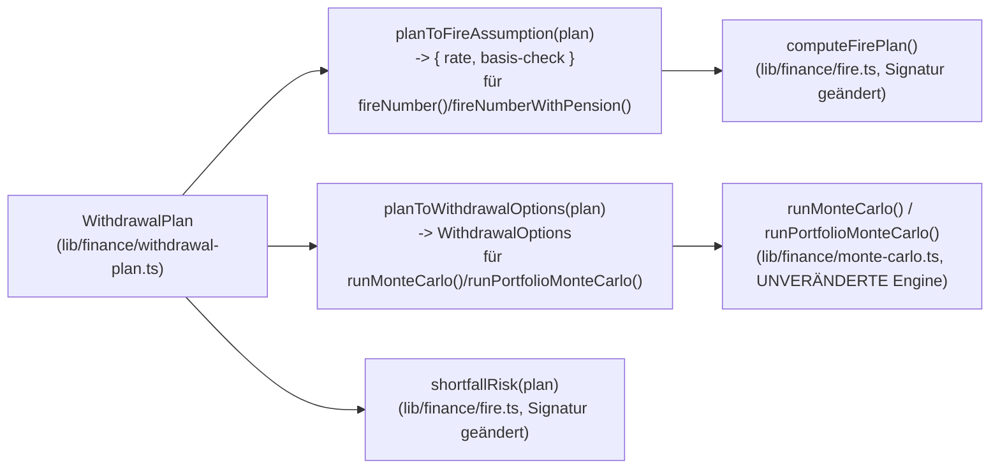

# Entnahme-Refactoring: Plan (nicht implementiert)

Status: **Planungsdokument, keine Implementierung begonnen.** Wartet auf Freigabe.

Diese Datei ist die vollständige Antwort auf den Planungsauftrag "Refactoring
sämtlicher Entnahmefunktionalitäten". Alle Zeilenangaben sind gegen den
aktuellen Stand von `feat/redesign` verifiziert (nicht aus CLAUDE.md
übernommen, sondern im Code nachgelesen — CLAUDE.md war an einer Stelle
nachweislich veraltet, siehe Abschnitt 3.9).

---

## 1. Inventar: alle Fundstellen

### 1.1 Reine Berechnungslogik (`lib/`)

| Datei | Rolle |
|---|---|
| `lib/finance/withdrawal.ts` | Entnahme-Engine: `WithdrawalPlan`, `WithdrawalStrategyId` (`fixed \| percentOfPortfolio \| guardrails \| floorCeiling \| vpw`), `annualWithdrawal()`, Stress-Szenarien, `summarizeStrategy()`. Pure, läuft im Worker. |
| `lib/finance/monte-carlo.ts` | `MonteCarloParams`/`PortfolioMonteCarloParams` (beide erben `WithdrawalOptions`), `runMonteCarlo()`, `runPortfolioMonteCarlo()`, `walkPath()`, `portfolioWithdrawalAfterPension()`. Ruft `withdrawal.ts` auf. |
| `lib/finance/fire.ts` | **Komplett eigene, zweite Formelwelt**: `fireNumber()` (`expenses / rate`, statische Perpetuität), `fireNumberWithPension()` (Bridge + Perpetuität, Rente als Barwert), `computeFirePlan()`, `shortfallRisk()` (ruft `runMonteCarlo` mit `withdrawalStrategy: "fixed"` fest verdrahtet), `PensionBridge`-Interface. |
| `lib/finance/monte-carlo.worker.ts` | Web-Worker-Wrapper um `runMonteCarlo`/`runPortfolioMonteCarlo`. |
| `lib/simulation/use-monte-carlo.ts` | `useMonteCarloRun()`, `hashSimParams()` (Cache-Key). **Korrektur nach Verifikation:** hat genau EINEN Aufrufer im gesamten Repo — `monte-carlo-panel.tsx:254`. Die FIRE-Risikokacheln laufen NICHT darüber: `shortfallRisk` (`fire.ts:203`) ruft `runMonteCarlo` **direkt und synchron** auf (`fire.ts:18`, `:217`), ohne Worker, ohne `simulation_runs`-Cache, mit festem Seed (`RISK_SEED`, `fire.ts:201`). Beide Seiten teilen sich nur die reine Funktion `runMonteCarlo`, nicht den Runner. |
| `lib/fire/use-fire-inputs.ts` | `useFireInputs()`: Nettovermögen, Ausgaben, Contribution, gemessene Rendite/Volatilität, Pension-Bridge — Eingaben für `computeFirePlan`. |
| `lib/pension/use-pension-bridge.ts` | `usePensionBridge()`: EINZIGE Quelle für `PensionBridge` (aus `projectPension`), von FIRE **und** Simulation genutzt. |
| `lib/llm/context.ts:118-127, 288` | LLM-Kontext: `fire.withdrawalRate` (Zahl) und `fire.withdrawalRatePct` (beide **im selben `fire`-Objekt**, `:284-292`, nicht im `pension`-Block) — Snapshot des FIRE-Slider-Werts, kein Strategie-Bezug. Bestätigt durch `tests/llm-context.test.ts:301` (`parsed.fire.withdrawalRatePct`). |

### 1.2 UI-Komponenten

| Datei | Rolle |
|---|---|
| `components/fire/fire-view.tsx` | FIRE-Tab. Eigener `withdrawalRatePercent`-State (Default 4, Slider 2-8%), eigener Hint-Text, kein Bezug zu `WithdrawalStrategyId`. Verlinkt zu `/simulation?years=…&withdrawal=30[&pensionAnnual=…&pensionStart=…]` — **die Entnahmerate wird beim Wechsel NICHT übergeben** (Zeile 163-170). |
| `components/simulation/monte-carlo-panel.tsx` | Simulation. Eigener `form.withdrawalRate`-State (Default 4, Slider 0-10%), eigener Hint-Text, plus `WithdrawalStrategyPanel` (Strategiewahl) und `WithdrawalComparison` (Ergebnisvergleich). Liest per `useSearchParams()` **nur** `years` und `withdrawal` als tatsächliche Werte (Zeile 102-103); `pensionAnnual` wird NUR als Anwesenheits-Flag genutzt (`params.has("pensionAnnual")`, Zeile 225, um den Toggle-Default zu setzen — die Beträge selbst kommen aus `usePensionBridge()`, Zeile 222), `pensionStart` wird von `fire-view.tsx` geschrieben (Zeile 169) aber **von nichts im Repo gelesen** (toter Query-Parameter, Korrektur nach Verifikation). Es kommen also **keine Rate, keine Strategie, keine Inflation** aus FIRE. |
| `components/simulation/withdrawal-strategy-panel.tsx` | `WithdrawalStrategyPanel` (Select + 3-Schritt-Anleitung je Strategie), `WithdrawalComparison` (Ergebnistabelle), `StressPicker`. **Nur in `monte-carlo-panel.tsx` eingebunden — trotz Doku-Behauptung "Identical panel on the FIRE tab" (DOCUMENTATION.md:1428-1429) NICHT auf der FIRE-Seite vorhanden.** |
| `components/llm/use-portfolio-chat.ts` | Ruft `computeFirePlan()` für den LLM-Kontext. |
| `components/analysis/trades-view.tsx`, `components/dashboard/net-worth-hero.tsx`, `components/shared/shared-portfolio-view.tsx`, `components/assets/asset-detail.tsx`, `components/assets/transaction-form.tsx` | Treffer für "withdrawal" sind hier **Transaktions-Withdrawals** (Konto-Abhebungen, Cashflow), fachlich unabhängig vom Entnahme-Domänenmodell — siehe Abgrenzung 3.10. |
| `components/charts/distribution-chart.tsx` | **Korrektur nach Verifikation: fälschlich als unabhängiger Cashflow-Treffer eingeordnet.** Ist tatsächlich der Simulations-Ergebnis-Chart (nur von `monte-carlo-panel.tsx:40/676` importiert/gerendert); der "withdrawal"-Treffer ist die Entnahmephasen-Grenze (`phaseBoundaryYear`, Zeile 59) — gehört ins Entnahme-Domänenmodell, nicht in die Abgrenzung 3.10. Steht korrekt als Erweiterungsziel in §11 Phase 4, wurde aber fälschlich zusätzlich in der Bestandsschutzliste §15 geführt — dort korrigiert. |

### 1.3 Übersetzungen (`lib/i18n/dictionaries.ts`)

- `fire.withdrawalRate.label` / `.hint` (Zeilen 1452-1453 en, 3927-3928 de, 6400-6401 es) — **eigenständiger Begriff**, Hint zitiert die "4%-Regel" wörtlich.
- `sim.withdrawalRate` / `.withdrawalRateHint` (Zeilen 2010-2011 en, 4487-4488 de, 6959-6960 es) — **zweiter, unabhängiger Begriff** ("Annual withdrawal rate" / "Jährliche Entnahmerate").
- `sim.inflation` / `.inflationHint` — nur auf der Simulationsseite, FIRE kennt keine Inflationsannahme überhaupt.
- `withdrawal.strategy.fixed` = "Fixed amount" / "Fester Betrag" / "Importe fijo" — **Label verspricht einen Geldbetrag, tatsächlich ist es eine Rate** (`rate * portfolioValueAtRetirement`, siehe 3.3).
- `withdrawal.strategy.*`, `withdrawal.steps.*.{1,2,3}`, `withdrawal.stress.*`, `withdrawal.col.*` — vollständig dreisprachig (en/de/es), von `tests/dictionaries-de.test.ts`/`-es.test.ts` auf Key- und Platzhalterparität gepinnt.

### 1.4 Tests

| Datei | Deckt ab |
|---|---|
| `tests/withdrawal.test.ts` (366 Zeilen) | `annualWithdrawal` je Strategie, Stress, `summarizeStrategy`, `runMonteCarlo` mit Strategien, Pension-Bridge in der Simulation, Inflationsindexierung, `vpw`. **Keine FIRE-Anbindung.** |
| `tests/fire.test.ts` (218 Zeilen) | `computeFirePlan`, `fireNumberWithPension`, `yearsToFire`. **Keine Strategie außer der impliziten Perpetuitätsformel; keine Übergabe an die Simulation.** |
| `tests/sim-params-hash.test.ts` (42 Zeilen) | `hashSimParams` Feldabdeckung. |
| `tests/llm-context.test.ts` | `fire.withdrawalRate`-Feld im LLM-Snapshot. |
| `tests/dictionaries-de.test.ts` / `-es.test.ts` | Key-/Platzhalterparität, inkl. `withdrawal.*`. |
| `tests/tour-steps.test.ts` | Deckt nur die Registry RISK/REBALANCING/SIMULATION/ASSET_TAGS ab (Zeilen 90-94) — `FIRE_TOUR_STEPS` (`tour-steps.ts:394`) ist **nicht** von diesem Test erfasst (Korrektur nach Verifikation). Die Step-Targets selbst existieren korrekt: `sim-withdrawal`/`withdrawal-strategy`/`withdrawal-comparison` (`tour-steps.ts:180/186/204`, nur Simulation) sowie `fire-inputs`/`fire-targets`/`fire-simulation` (`:397/403/409`, FIRE, ohne Strategie-Schritt), passend zu den `data-tour`-Attributen in `fire-view.tsx:174/264/316`. |
| `e2e/simulation.spec.ts:37,43,70,44` | Prüft Query-Param-Weitergabe `years`/`withdrawal` (Zeile 37, 70) und den Text "Annual withdrawal rate" (Zeile 43); Zeile 44 prüft zusätzlich den Text "Withdrawal strategy" (Korrektur: die ursprünglich zitierte Zeile 82 ist der unabhängige Stress-Szenario-Test). **Keine Rate/Strategie-Übergabe zwischen den Seiten getestet, weil es sie nicht gibt.** |

### 1.5 Renten-/Versicherungszuflüsse

| Datei | Rolle |
|---|---|
| `lib/finance/pension.ts` (`projectPension`) | Einzige Quelle für Renten-/Versicherungsprojektion (gesetzlich + privat). |
| `lib/pension/use-pension-bridge.ts` | Bricht `projectPension` auf `PensionBridge {annualIncome, yearsUntilStart}` herunter — von FIRE und Simulation geteilt (korrekt, kein Widerspruch hier). |
| `lib/finance/fire.ts` (`fireNumberWithPension`) | Nutzt die Bridge für die **statische** Zielvermögensformel (Bridge-Jahre + Perpetuität, Rente als Barwert). |
| `lib/finance/monte-carlo.ts` (`portfolioWithdrawalAfterPension`) | Nutzt dieselbe Bridge für die **pfadweise** Simulation (Rente wird pro simuliertem Jahr vom Bruttobedarf abgezogen). |

**Kein Widerspruch bei der Renten-Herkunft** (eine Bridge, ein `usePensionBridge`) — der Widerspruch liegt eine Ebene höher: die zwei Formelwelten, die die Bridge konsumieren (statische Perpetuität vs. Pfadsimulation), sind selbst nicht harmonisiert (siehe 3.6).

### 1.6 Gespeicherte Zustände

- `simulation_runs` (Supabase, Tabelle erstellt `supabase/schema.sql:1078`, Index `:1089`, RLS aktiviert `:1281`, Policy-Definition `:1522` — Korrektur der Zeilenangabe nach Verifikation) + `lib/store/*-store.ts` `save/loadSimulation`: **reiner Ergebnis-Cache**, keyed by `hashSimParams()`. Kein persistiertes "Entnahme-Assumption"-Objekt. Migration hiervon ist unkritisch (Cache, kein Datenverlust bei Invalidierung).
- `fire.withdrawalRatePercent` (FIRE-Tab) und `form.withdrawalRate` (Simulation) sind **React-`useState`, nicht persistiert** — bestätigt durch `[[simulation-inputs-are-live]]`-Memory-Regel ("what-if levers stay in React state; never persist a projection input"). Es gibt also **keine** in der DB liegende alte Entnahmerate zu migrieren.
- Migriert werden muss NUR: die Bedeutung der Strategie-ID `"fixed"` (Label "Fester Betrag", tatsächlich Raten-basiert) — siehe Abschnitt 7.

---

## 2. Datenfluss (Ist-Zustand)

```mermaid
flowchart TB
    subgraph FIRE["/retirement Tab FIRE (fire-view.tsx)"]
        FR["withdrawalRatePercent state\nDefault 4%, Slider 2-8%"]
        FP["computeFirePlan()\nfireNumber = expenses / rate\n(statische Perpetuität)"]
        FB["usePensionBridge()"]
        FR --> FP
        FB --> FP
    end

    subgraph LINK["Übergang FIRE -> Simulation"]
        QP["URLSearchParams:\nyears, withdrawal=30,\npensionAnnual?, pensionStart?\n(KEINE Rate, KEINE Strategie, KEINE Inflation)"]
    end

    subgraph SIM["/simulation (monte-carlo-panel.tsx)"]
        SR["form.withdrawalRate state\nDefault 4%, Slider 0-10%\n(komplett unabhängig von FR)"]
        SS["withdrawalStrategy state\nfixed/percentOfPortfolio/\nguardrails/floorCeiling/vpw"]
        SI["inflation state\n(FIRE kennt keine Inflation)"]
        MC["runMonteCarlo() / runPortfolioMonteCarlo()\npfadweise Simulation je Jahr"]
        SR --> MC
        SS --> MC
        SI --> MC
        FB2["usePensionBridge()\n(zweiter, aber identischer Aufruf)"] --> MC
    end

    FP -.->|"years, withdrawal-Dauer,\npensionAnnual/Start NUR wenn\ncountPension=true"| QP
    QP --> SR
    QP --> SS
    QP --> SI

    style QP fill:#3a2020,stroke:#c44
```



**Offene Fragen, die der Code beantwortet (nicht dokumentiert, sondern nachgelesen):**

- *Woher kommt die Rate?* Zwei unabhängige `useState`, beide Default 4, beide ohne Verbindung.
- *Wo wird sie gespeichert?* Nirgends — reines UI-State, `[[simulation-inputs-are-live]]`.
- *Formel FIRE?* `fireNumber = annualExpenses / withdrawalRate` (statische Perpetuität, `lib/finance/fire.ts:62-65`), mit Pension: `fireNumberWithPension` (Bridge-Barwert + diskontierte Perpetuität, Zeilen 125-141).
- *Formel Simulation?* Pfadweise: `annualWithdrawal(plan, ctx)` pro simuliertem Jahr, abhängig von der gewählten Strategie (`lib/finance/withdrawal.ts:95-155`).
- *Wann Inflation?* NUR in der Simulation (`plan.inflation`, Default `DEFAULT_INFLATION=0.02`). FIRE hat **keinen** Inflationsparameter — `fireNumber` ist implizit eine "heutiges Geld"-Rechnung ohne Inflationspfad.
- *Bezugswert %?* Hängt von der Strategie ab und ist in der UI nicht erklärt: `fixed` = einmalig bei Rentenbeginn (`rate * value`, dann inflationsindexiert fortgeschrieben — Zeile 245: `initialWithdrawal = o.plan.rate * value` nur bei `yearsIntoRetirement === 0`); `percentOfPortfolio` = **jedes Jahr neu** vom aktuellen Wert (Zeile 112-113); `floorCeiling`/`guardrails`/`vpw` = eigene Mischformen. FIRE's Rate bezieht sich auf **keinen** Zeitpunkt im Pfad-Sinn, sondern ist der Nenner einer statischen Formel.
- *Rente/Versicherung?* Eine geteilte Bridge (`usePensionBridge`), aber zwei verschiedene Verrechnungsformeln (Barwert vs. pfadweise Subtraktion) — siehe 3.6.
- *Welche Parameter gehen FIRE -> Simulation über?* `years` (Zeithorizont bis FI), `withdrawal` (feste **Dauer** 30 Jahre, keine gewählte), `pensionAnnual`/`pensionStart` (nur wenn `countPension` an war). **Nicht übergeben:** `withdrawalRatePercent`, jegliche Strategie, Inflation.
- *Alte/doppelte Modelle?* Ja — zwei Domänenmodelle für "was ist eine Entnahmerate", die zufällig denselben Namen tragen.

---

## 3. Fachliche Widersprüche (verifiziert)

### 3.1 Zwei unabhängige Zustände für "dieselbe" Rate
`fire-view.tsx:83` (`withdrawalRatePercent`, Default 4, Range 2-8%) und
`monte-carlo-panel.tsx:200` (`form.withdrawalRate ?? WITHDRAWAL_RATE_DEFAULT`,
Default 4, Range 0-10%) sind komplett getrennte React-States mit
unterschiedlichem Wertebereich. Ein Nutzer, der auf der FIRE-Seite 3,5%
einstellt, sieht in der Simulation wieder 4%.

### 3.2 Verschiedene Slider-Ranges für denselben Begriff
FIRE: 2-8% in 0,1-Schritten. Simulation: 0-10% in 0,1-Schritten. Beide zeigen
denselben Text "Entnahmerate", meinen aber unterschiedliche Wertebereiche als
"normal".

### 3.3 Strategie-Label lügt: "Fester Betrag" ist keiner
`withdrawal.strategy.fixed` = "Fixed amount" / "Fester Betrag" (dictionaries.ts
1377/3848/6323). Tatsächliche Berechnung
(`lib/finance/withdrawal.ts:106-107`): `indexed(ctx.initialWithdrawal)`, wobei
`initialWithdrawal = plan.rate * value` — also **eine Rate, kein Betrag**. Die
UI zeigt bei gewählter Strategie "Fester Betrag" weiterhin ein Prozent-Feld
(`sim.withdrawalRate`, `monte-carlo-panel.tsx:506-517`), weil der Code intern
gar keinen Betrags-Eingabepfad kennt. Das ist exakt der vom Auftraggeber
beschriebene Bug — verifiziert im Code, nicht nur behauptet.

### 3.4 Kein UI-Feld für einen echten "anfänglichen Betrag in Euro" — Korrektur nach Verifikation
Die Engine kennt bereits einen Euro-Betrags-Pfad: `MonteCarloParams
.monthlyWithdrawal` (`lib/finance/monte-carlo.ts:65`) und
`PortfolioMonteCarloParams.monthlyWithdrawal` (`:443`) nehmen einen festen
Monatsbetrag entgegen, umgesetzt als `flatWithdrawal` in `walkPath()`
(`:234`, `:254` `o.flatWithdrawal * 12`, `:274`) und im Portfolio-Walk
(`:491`, `:531`, `:553`), getestet in `tests/finance.test.ts:815` und `:835`.
Es existiert sogar ein bereits dreisprachiger, aktuell ungenutzter
Übersetzungs-Key `sim.monthlyWithdrawal` = "Monthly withdrawal" /
"Monatliche Entnahme" / "Retirada mensual"
(`dictionaries.ts:2009 / 4486 / 6958`).

**Was tatsächlich fehlt:** (a) kein UI-Formularfeld bindet diesen Pfad an —
`WithdrawalStrategyPanel`/`monte-carlo-panel.tsx` setzen `monthlyWithdrawal`
nie; (b) dieser Pfad ist **unindexiert** (`flatWithdrawal` bleibt über die
gesamte Laufzeit konstant, keine Inflationsanpassung in `walkPath`) —
genau das Gegenteil dessen, was der Auftrag für "Fester realer Betrag"
verlangt (Kaufkraft soll über Inflation erhalten bleiben); (c)
`WithdrawalPlan.rate` (`withdrawal.ts:56`) ist tatsächlich immer eine
Fraktion, aber `WithdrawalPlan` und `monthlyWithdrawal` sind zwei getrennte,
sich gegenseitig ausschließende Parameterpfade in `MonteCarloParams`, kein
gemeinsames Modell.

Die vom Auftraggeber geforderte Strategie 1 ("Fester realer Betrag", Nutzer
gibt einen Euro-Betrag ein, inflationsindexiert) existiert also **teilweise**
in der Engine (unindexierter Betragspfad), aber **nicht** in der UI und
**nicht** inflationsindexiert — sie wird in der UI derzeit mit `fixed`
verwechselt, obwohl `fixed` tatsächlich Strategie 2 des Auftrags ist
("Klassische anfängliche Entnahmerate").

### 3.5 Bezugswert eines Prozentsatzes ist pro Strategie verschieden, aber UI erklärt es nicht
`fixed`: einmalig bei Rentenbeginn. `percentOfPortfolio`: **jedes Jahr neu**
vom aktuellen Wert. `floorCeiling`: Zielrate vom aktuellen Wert, aber
geklammert an Vielfache des Jahr-1-Betrags. `guardrails`: Rate ist der
Zielkorridor, nicht der Auszahlungsbetrag selbst. `vpw`: Rate wird nur für
Jahr 1 verwendet, danach ersetzt durch eine Annuitätenformel. Ein einziges
generisches Label "sim.withdrawalRate" / "Jährliche Entnahmerate" steht über
allen fünf, ohne die fünf verschiedenen Bezüge zu benennen.

### 3.6 FIRE und Simulation benutzen strukturell verschiedene Formeln für "wie viel darf ich entnehmen"
FIRE: geschlossene Perpetuitätsformel (`expenses / rate`, ggf. mit
Renten-Barwert-Korrektur). Simulation: stochastische Pfadsimulation mit
zeitabhängiger Strategie. Das sind fachlich unterschiedliche, aber verwandte
Fragen ("wie groß muss das Ziel sein" vs. "wie verhält sich ein Pfad") — das
Problem ist nicht, dass es zwei Formeln gibt (das ist legitim, siehe
Domänenmodell §5), sondern dass **keine gemeinsame Terminologie und kein
gemeinsamer Eingabe-Zustand** zwischen ihnen existiert. `computeFirePlan`
kennt gar keine `WithdrawalStrategyId` — es rechnet implizit immer mit dem
Äquivalent von `fixed`-am-Rentenbeginn (der 4%-Regel-Formel), selbst wenn der
Nutzer in der Simulation `percentOfPortfolio` gewählt hat. Wechselt der Nutzer
zur Simulation, wird faktisch eine andere Strategie angewendet als die, die
das FIRE-Ziel berechnet hat, ohne dass die UI das ausweist.

### 3.7 Inflation existiert nur auf einer Seite
FIRE hat keinen Inflationsparameter. Der "4%-Regel"-Hint auf der FIRE-Seite
(`fire.withdrawalRate.hint`) verspricht implizit reale Kaufkraft, ohne dass
irgendeine Inflationsannahme sichtbar oder einstellbar wäre. Die Simulation
hat einen expliziten `inflation`-Slider (Default 2%). Ob FIRE "real" oder
"nominal" rechnet, ist für den Nutzer nicht erkennbar (tatsächlich: FIRE
rechnet in heutigem Geld ohne Inflationspfad, weil `fireNumber` ein
statischer Snapshot ist — es gibt keinen Zeitverlauf, den Inflation
beeinflussen könnte).

### 3.8 Übergabe FIRE -> Simulation ist unvollständig und einseitig
`fire-view.tsx:163-170` baut `simulationParams` aus `years`,
`withdrawal="30"` (hart codierte Dauer, nicht die vom Nutzer evtl. gewünschte),
und optional `pensionAnnual`/`pensionStart`. **Nicht übergeben:** die vom
Nutzer eingestellte Entnahmerate, jegliche Strategie-Wahl (die FIRE-Seite
kennt gar keine), keine Inflation. Der Auftraggeber fordert ausdrücklich
"Eine in FIRE konfigurierte Annahme muss verlustfrei an die Simulation
übergeben werden können" — das ist heute nicht der Fall, noch nicht einmal für
den einzigen Parameter, den FIRE überhaupt anbietet (die Rate).

### 3.9 Dokumentation widerspricht dem Code
`DOCUMENTATION.md:1428-1429` behauptet: "Identical panel on the FIRE tab;
identical runner (`useMonteCarloRun`) behind both." **Korrektur nach
Verifikation: Das stimmt für KEINE der beiden Hälften.** Das Panel: wie
angenommen falsch — `fire-view.tsx` importiert `WithdrawalStrategyPanel`
nicht und zeigt keine Strategiewahl. Der Runner: ebenfalls falsch —
`useMonteCarloRun` hat genau EINEN Aufrufer im Repo
(`monte-carlo-panel.tsx:254`); die FIRE-Kacheln laufen über `shortfallRisk`
(`fire.ts:203`), das `runMonteCarlo` direkt und synchron aufruft, ohne
Worker, ohne `simulation_runs`-Cache, mit festem Seed — siehe korrigiertes
§1.1. Beide Seiten teilen sich nur die reine Berechnungsfunktion
`runMonteCarlo`, nicht die Orchestrierung darum. Dieselbe veraltete
Formulierung findet sich zusätzlich in Code-Kommentaren
(`withdrawal-strategy-panel.tsx:5`, `monte-carlo-panel.tsx:535`) — auch
diese sind im Rahmen des Refactorings zu korrigieren, nicht nur der
DOCUMENTATION.md-Absatz. Die Doku ist an dieser Stelle veraltet (vermutlich
seit einer früheren Version, in der das Panel wirklich auf beiden Seiten
stand) und muss im Rahmen dieses Refactorings korrigiert werden — sonst
bleibt der Widerspruch bestehen, nur jetzt fälschlich für "bekannt/gewollt"
gehalten.

### 3.10 Namenskollision mit einem fachlich unabhängigen "Withdrawal"-Begriff
`components/assets/transaction-form.tsx`, `net-worth-hero.tsx`,
`trades-view.tsx` etc. verwenden "withdrawal" im Sinne einer **Konto-Abhebung**
(Buchungstyp), nicht im Sinne der Entnahme-Strategie. Das ist fachlich korrekt
getrennt (verschiedene Bounded Contexts) und **kein** Widerspruch im
Entnahme-Modell — wird hier nur dokumentiert, damit spätere Grep-Suchen nach
"withdrawal" nicht versehentlich Cashflow-Code anfassen. Siehe
Bestandsschutzliste (§13).

### 3.11 `shortfallRisk` (FIRE-Kacheln) ist strategisch nicht mit der Nutzerwahl verbunden
`lib/finance/fire.ts:203-234` ruft `runMonteCarlo` mit
`withdrawalStrategy: "fixed"` fest verdrahtet auf — unabhängig davon, welche
Strategie der Nutzer später in der Simulation wählen würde. Das
Risiko-Badge auf den FIRE-Kacheln ("X% Erschöpfungsrisiko") beantwortet also
implizit "wenn ich fix entnehme", nicht "bei meiner gewählten Strategie" — für
den heutigen Stand (FIRE kennt keine Strategie) ist das konsistent, wird aber
zum Widerspruch, sobald FIRE im neuen Modell eine Strategie kennt und diese
nicht an `shortfallRisk` durchreicht.

---

## 4. Zusammenfassung der Widersprüche (Tabelle)

| # | Widerspruch | Ort | Schweregrad |
|---|---|---|---|
| 3.1 | Zwei unabhängige Raten-States | fire-view.tsx / monte-carlo-panel.tsx | Hoch |
| 3.2 | Unterschiedliche Slider-Ranges | dito | Mittel |
| 3.3 | "Fester Betrag"-Label ist eine Rate | withdrawal.ts + dictionaries | Hoch |
| 3.4 | Keine echte Betrags-Eingabe existiert | withdrawal.ts | Hoch |
| 3.5 | Bezugswert pro Strategie unklar in UI | withdrawal-strategy-panel.tsx | Hoch |
| 3.6 | Strukturell verschiedene Formeln ohne gemeinsames Modell | fire.ts vs. monte-carlo.ts | Hoch |
| 3.7 | Inflation nur in Simulation | fire-view.tsx | Mittel |
| 3.8 | Unvollständige/einseitige Parameterübergabe | fire-view.tsx:163-170 | Hoch |
| 3.9 | Doku widerspricht Code (Panel UND Runner) | DOCUMENTATION.md:1428-1429 | Niedrig (Doku-Fix) |
| 3.11 | `shortfallRisk` ignoriert Strategiewahl | fire.ts:203-234 | Mittel |

---

## 5. Vorgeschlagenes gemeinsames Domänenmodell

### 5.1 Kernentscheidung

Ein einziges TypeScript-Modul `lib/finance/withdrawal-plan.ts` (neu, ersetzt
NICHT `withdrawal.ts`, sondern liegt eine Ebene darüber) definiert:

```ts
/** Wie ein Betrag gemeint ist: Basis für die "%"-Interpretation. */
export type WithdrawalRateBasis =
  | "atRetirement"   // % vom Portfoliowert bei Rentenbeginn (einmalig)
  | "currentValue";  // % vom jeweils aktuellen Portfoliowert (jährlich neu)

/** Die vier geprüften, klar definierten Strategien (siehe §6). */
export type WithdrawalStrategyKind =
  | "fixedRealAmount"       // NEU: echter Euro-Betrag, inflationsindexiert
  | "initialRate"           // = bisheriges "fixed", umbenannt + korrekt beschrieben
  | "currentPortfolioShare" // = bisheriges "percentOfPortfolio"
  | "guardrails";           // = bisheriges "guardrails" (Guyton-Klinger)

// floorCeiling und vpw: siehe §6.5 "Nicht übernommene Strategien" — bleiben
// als interne Engine-Optionen bestehen (Bestandsschutz, keine Tests brechen),
// werden aber NICHT ins neue Domänenmodell als First-Class-Strategie gehoben,
// weil ihre UI-Beschreibung heute nicht die Kriterien aus §6 erfüllt (siehe dort).

export interface WithdrawalPlan {
  /** Eindeutige, sprechende Strategie-ID. */
  strategy: WithdrawalStrategyKind;

  /** Beginn der Entnahmephase: Kalenderjahr, aus FIRE (`retirementYear`)
   *  oder aus der Simulation (`heute + years`) abgeleitet — NIE getrennt
   *  eingegeben. */
  startYear: number;

  /** Ausgangsbetrag/-rate, je nach Strategie: */
  amount:
    | { kind: "annualAmount"; value: number }   // fixedRealAmount
    | { kind: "rate"; value: number; basis: WithdrawalRateBasis }; // initialRate | currentPortfolioShare | guardrails

  /** Inflationsbehandlung — verbindlich für JEDE Strategie, kein Sonderfall. */
  inflation: {
    /** Ob der Betrag/die Rate jährlich mit Inflation fortgeschrieben wird. */
    indexed: boolean;
    /** Angenommene jährliche Inflation, Fraktion. Nur relevant wenn indexed. */
    assumedRate: number;
  };

  /** Zahlungsintervall — bisher implizit "jährlich pro Simulationsjahr",
   *  wird jetzt explizit, weil UI monatliche Beträge anzeigt (sim.perMonth)
   *  ohne dass das Modell ein Intervall kennt. */
  paymentInterval: "monthly" | "annual";

  /** Nur für `guardrails`: Band + Schrittgröße. Ausschließlich hier gültig,
   *  TypeScript-diskriminiert über `strategy`. */
  guardrails?: { band: number; adjust: number };

  /** Erwartete Renten-/Versicherungszuflüsse — Zuflüsse, KEINE Strategie
   *  (siehe §8). Optional, weil nicht jeder Plan eine Rente hat. */
  guaranteedIncome?: {
    annualAmount: number; // heutiges Geld, wie von usePensionBridge geliefert
    yearsUntilStart: number;
  };

  /** Verhalten in schlechten Marktphasen — bereits vorhanden als
   *  `StressScenario`, wird 1:1 übernommen (kein neues Konzept nötig). */
  stress: StressScenario; // aus lib/finance/withdrawal.ts, re-exportiert

  /** Rundungs-/Zeitregeln: auf volle Einheiten runden, wie Betrag pro
   *  Monatsintervall abgeleitet wird. */
  rounding: { toNearest: number }; // z.B. 1 = auf ganze Einheit, 10, 100
}
```

**Warum kein separates `floor`/`ceiling` als First-Class-Feld?** Weil
`floorCeiling` gemäß §6.5 nicht die Kriterien für eine im neuen Modell
first-class geführte Strategie erfüllt (siehe dort) — es bleibt Engine-intern
verfügbar, aber ohne eigenes UI-Presets im neuen `WithdrawalPlan`.

### 5.2 Wo lebt der Plan?

- **FIRE** hält genau EIN `WithdrawalPlan` (State in `fire-view.tsx`, ersetzt
  `withdrawalRatePercent`). `computeFirePlan()` wird umgebaut, um einen
  `WithdrawalPlan` statt einer nackten `withdrawalRate: number`
  entgegenzunehmen (Signaturänderung, siehe §6 und §11 Phase 2).
- **Simulation** übernimmt beim Mount einen `WithdrawalPlan` aus den
  Query-Parametern (serialisiert, siehe §7.3) als **Ausgangspunkt**, hält
  aber ihre eigene Kopie im React-State (`what-if`, bleibt unverändert
  gemäß `[[simulation-inputs-are-live]]` — wird NICHT persistiert). Jede
  Abweichung vom übergebenen Plan wird visuell markiert ("vom FIRE-Ziel
  abweichend" — siehe §9.3).
- **Keine dritte Kopie.** `shortfallRisk` (FIRE-Kacheln) bekommt denselben
  `WithdrawalPlan` statt des hart codierten `"fixed"`.

### 5.3 Zentrale Berechnungsarchitektur



**Wichtig:** Die bestehende Engine (`annualWithdrawal`, `walkPath`,
`runMonteCarlo`) bleibt **unverändert** — sie ist bereits pfadweise korrekt
und gut getestet (366 Zeilen Tests). Das neue Modell ist eine
**Übersetzungsschicht** (`planToWithdrawalOptions`/`planToFireAssumption`),
keine Neuimplementierung der Simulation. Das minimiert Risiko und
Testaufwand gegenüber einem kompletten Engine-Rewrite.

`fireNumber`/`fireNumberWithPension` bleiben als reine Perpetuitätsformeln
bestehen, akzeptieren aber nur noch Pläne mit `basis: "atRetirement"` +
`indexed: true` sinnvoll (siehe §6.2/6.3) — ein Plan mit
`currentPortfolioShare` hat fachlich **kein** geschlossenes Zielvermögen
(siehe §6.3, "kein konstantes Ziel berechenbar") und `computeFirePlan` muss
das explizit ausweisen statt eine falsche Zahl zu drucken (§9.4).

---

## 6. Exakte Definition jeder Strategie

### 6.1 Strategie A — Fester realer Betrag (`fixedRealAmount`) — NEU

- **Ein-Satz-Erklärung:** Du entnimmst einen festen Betrag, der jedes Jahr um
  die Inflation steigt, damit die Kaufkraft gleich bleibt.
- **Formel:** Jahr 0: `amount.value` (nominal). Jahr n:
  `amount.value * (1 + inflation.assumedRate)^n`.
- **Eingaben:** `amount.value` (monatlich ODER jährlich, umrechenbar über
  `paymentInterval`), `inflation.assumedRate`, `paymentInterval`.
- **Einkommensstabilität:** Konstant in Kaufkraft, konstant in Planbarkeit.
  Reagiert NIE auf den Portfoliowert.
- **Erschöpfungsrisiko:** Am höchsten aller vier Strategien — der Betrag wird
  auch dann entnommen, wenn das Portfolio fällt.
- **Inflationsbehandlung:** Immer indexiert (Kern der Strategie); ein
  "nicht indexiert"-Toggle ist erlaubt (Auftrag: "fester realer Betrag mit
  und ohne Inflation" testen), aber Default = indexiert.
- **Zahlenbeispiel:** 2.000 €/Monat = 24.000 €/Jahr, 2% Inflation. Jahr 1:
  24.000 €. Jahr 10: 24.000 € × 1,02⁹ ≈ 28.700 €.
- **Engine-Umsetzung — Korrektur nach Verifikation:** Die Engine hat bereits
  einen Betrags-Pfad (`monthlyWithdrawal`/`flatWithdrawal`, siehe 3.4), er ist
  nur unindexiert und UI-seitig nicht angebunden. Zwei Optionen, zur
  Owner-Entscheidung in Phase 0:
  (a) den bestehenden `flatWithdrawal`-Zweig in `walkPath()`
  (`lib/finance/monte-carlo.ts:234-280`) um jährliche Inflationsindexierung
  erweitern (kleinerer Diff, nutzt vorhandenen Pfad) — **empfohlen**, da kein
  neues Feld in `WithdrawalOptions` nötig ist, nur `flatWithdrawal *
  (1+inflation)^yearsIntoRetirement` statt eines konstanten Werts; oder
  (b) einen komplett neuen `fixedAnnualAmount`-Zweig einführen und
  `monthlyWithdrawal` unangetastet/deprecated lassen (mehr Code, vermeidet
  Verhaltensänderung am bestehenden unindexierten Pfad, falls dieser noch
  irgendwo — auch außerhalb der UI, z. B. programmatisch — erwartet wird;
  laut Grep gibt es dafür aber keinen Aufrufer außer den Tests). `rate =
  amount.value / initialCapitalAtRetirement` wird in keinem Fall berechnet
  — das wäre wieder eine versteckte Rate. In beiden Varianten: minimale,
  chirurgische Erweiterung, kein Bruch bestehender Signaturen.

### 6.2 Strategie B — Klassische anfängliche Entnahmerate (`initialRate`) — bisher `fixed`

- **Ein-Satz-Erklärung:** Du legst einen Prozentsatz des Portfolios bei
  Rentenbeginn fest; der daraus berechnete Betrag steigt danach nur noch mit
  der Inflation, nicht erneut mit dem Portfolio.
- **Formel:** Jahr 0: `rate * portfolioValueAtRetirement`. Jahr n:
  Jahr-0-Betrag `* (1 + inflation)^n`. — **identisch mit der bestehenden
  `fixed`-Engine-Logik**, nur umbenannt und korrekt beschriftet.
- **Eingaben:** `amount = {kind: "rate", value, basis: "atRetirement"}`,
  `inflation.assumedRate`.
- **Einkommensstabilität:** Hoch (wie fixedRealAmount) — nach der Festlegung
  reagiert der Betrag nie wieder auf den Portfoliowert.
- **Erschöpfungsrisiko:** Wie fixedRealAmount, aber Ausgangsbetrag ist
  vermögensabhängig statt frei gewählt.
- **Zahlenbeispiel (aus dem Auftrag übernommen, jetzt Pflichtbestandteil der
  UI):** "Bei 400.000 € Portfolio und 4% Entnahmerate beträgt die Entnahme
  im ersten Jahr 16.000 €. Danach steigt dieser Geldbetrag mit der
  Inflation, unabhängig vom aktuellen Portfoliowert."
- **UI-Pflichthinweis:** Muss ausdrücklich sagen, dass sich die Rate NUR auf
  den Wert bei Rentenbeginn bezieht (Auftrag, wörtlich gefordert).
- **Engine:** Keine Änderung — `WithdrawalStrategyId: "fixed"` bleibt
  intern bestehen (Bestandsschutz für Tests/Worker-Serialisierung), das neue
  Modell mappt `initialRate -> "fixed"` in `planToWithdrawalOptions`.

### 6.3 Strategie C — Prozentsatz des aktuellen Portfolios (`currentPortfolioShare`) — bisher `percentOfPortfolio`

- **Ein-Satz-Erklärung:** Jedes Jahr wird derselbe Prozentsatz des dann
  aktuellen Portfoliowerts entnommen.
- **Formel:** Jahr n: `rate * portfolioValueAtStartOfYear_n`.
- **Eingaben:** `amount = {kind: "rate", value, basis: "currentValue"}`.
  KEIN Inflationsfeld nötig/sinnvoll (der Betrag passt sich über den
  Marktwert ohnehin an — ein zusätzliches `indexed` wäre eine zweite,
  widersprüchliche Anpassung). `inflation.indexed` wird für diese Strategie
  in der UI ausgeblendet und im Modell auf `false` erzwungen.
- **Einkommensstabilität:** Niedrig — schwankt 1:1 mit dem Marktwert.
- **Erschöpfungsrisiko:** Mathematisch nahe null (nie mehr als X% eines
  positiven Bestands kann ihn auf 0 bringen, siehe bestehenden Test
  "percentOfPortfolio never depletes, fixed can",
  `tests/withdrawal.test.ts:174`), aber das erkauft sich mit einem
  Einkommen, das in schlechten Jahren stark fällt.
- **UI-Pflichthinweis:** Darf NICHT den Eindruck eines konstanten Einkommens
  erwecken (Auftrag, wörtlich). Muss stattdessen die Schwankungsbreite
  zeigen (z. B. Median + Worst-Year aus `WithdrawalComparison`, bereits
  vorhanden).
- **Kein FIRE-Zielvermögen im klassischen Sinn:** `fireNumber = expenses /
  rate` funktioniert rechnerisch, beschreibt bei dieser Strategie aber NICHT
  "das Vermögen hält für immer", sondern nur "im ERSTEN Jahr entspricht die
  Entnahme den Ausgaben" — jedes Folgejahr weicht vom Ausgabenbedarf ab, je
  nach Markt. `computeFirePlan` muss bei dieser Strategie einen Hinweis
  statt einer unqualifizierten Zahl zeigen (§9.4).

### 6.4 Strategie D — Dynamische Entnahme mit Leitplanken (`guardrails`) — bereits vorhanden, reproduzierbar

Bereits im Code testbar definiert (`lib/finance/withdrawal.ts:130-140`,
Guyton-Klinger):

- **Erhöhung/Senkung:** Einmal pro Jahr geprüft. Vorjahresbetrag wird zuerst
  um `inflation` erhöht, DANACH wird geprüft, ob die daraus resultierende
  aktuelle Rate (`previous / portfolioValue`) außerhalb von `rate * (1 ±
  band)` liegt.
- **Grenzwerte:** `band` (Default 20%, `DEFAULT_GUARDRAIL_BAND`), `adjust`
  (Default 10%, `DEFAULT_GUARDRAIL_ADJUST`) — beide bereits vorhanden, aber
  in der UI (`monte-carlo-panel.tsx`) **nicht editierbar** (Lücke, siehe
  §8 Testmatrix/§11 Phase 3).
- **Inflationsaussetzung:** Nicht implementiert — jedes Jahr wird IMMER
  zuerst mit Inflation hochgerechnet, bevor die Bänder geprüft werden. Kein
  Toggle "Inflationsanpassung aussetzen" vorhanden. **Entscheidung für
  diesen Plan:** NICHT nachrüsten (kein dokumentierter/testbarer
  Algorithmus dafür im Auftrag gefordert — "nur einplanen, wenn eine
  nachvollziehbare und testbare Definition vorhanden ist"; die klassische
  Guyton-Klinger-Variante mit Aussetzung ist in der Literatur uneinheitlich
  genug, dass sie hier bewusst NICHT erfunden wird).
- **Mindest-/Höchstentnahme:** Nicht vorhanden (das ist `floorCeiling`, eine
  separate Strategie). Guardrails hat nur die Bandgrenzen, keine absoluten
  Grenzen.
- **Ein-Satz-Erklärung:** Die Entnahme bleibt jedes Jahr gleich (inflationiert),
  außer die aktuelle Entnahmequote hat sich zu weit vom Zielwert entfernt —
  dann wird sie in einem Schritt angepasst.
- **UI:** `band`/`adjust` müssen einstellbar werden (Ergänzung, kein
  Formel-Wechsel — reiner UI-Lückenschluss).

### 6.5 Nicht als First-Class-Strategie übernommene Kandidaten

- **`floorCeiling`:** Bleibt Engine-intern bestehen (Tests grün halten,
  Bestandsschutz), wird aber NICHT in das neue `WithdrawalPlan`-Modell als
  eigene UI-Strategie gehoben. Begründung: Der Auftrag verlangt für
  Strategie 4 "welche Mindest- und Höchstentnahmen gelten" als vom
  Domänenmodell verlangte Eigenschaft von "Leitplanken" — `floorCeiling` und
  `guardrails` decken zusammen dasselbe Bedürfnis ab, aber mit
  unterschiedlichen Mechaniken (Klammerung vs. Bandsprung). Zwei
  Leitplanken-Varianten gleichzeitig als First-Class UI-Strategie zu führen
  widerspricht "keine unspezifischen/verwirrenden Strategien" — offene
  Entscheidung, siehe §12 (Risiken/offene Entscheidungen), dort zur
  Bestätigung durch den Owner vorgelegt.
- **`vpw` (Variable Percentage Withdrawal):** Bleibt Engine-intern bestehen
  (Bestandsschutz, Tests bleiben grün), wird NICHT ins neue Domänenmodell
  aufgenommen. Begründung: Der Auftrag listet genau vier zu prüfende
  Kernstrategien und verbietet ausdrücklich "keine neuen Strategien
  einführen, deren Algorithmus nicht eindeutig definiert und getestet ist" —
  `vpw` IST getestet und definiert, aber es ist eine FÜNFTE Strategie, die
  im Auftrag nicht verlangt wurde. Sie bleibt technisch abrufbar
  (Bestandsschutz für bestehende Nutzer/Tests), verschwindet aber aus der
  primären Strategie-Auswahl der UI, bis der Owner sie ausdrücklich als
  fünfte Option bestätigt (§12).

---

## 7. Migrations- und Kompatibilitätskonzept

### 7.1 Was migriert werden muss

Wie in §1.6 festgestellt: **keine persistierte Nutzerrate** existiert
(`[[simulation-inputs-are-live]]`). Es gibt daher **keine stille
Bedeutungsänderung** eines gespeicherten Prozentwerts zu befürchten — die
einzige "Altlast" ist:

1. Der interne Strategie-Bezeichner `"fixed"` (bleibt technisch als
   `WithdrawalStrategyId` bestehen — siehe §6.2, Mapping
   `initialRate -> "fixed"`). **Kein DB-Migrationsscript nötig.**
2. Der `simulation_runs`-Cache: Alte gecachte Ergebnisse mit dem alten
   Parametersatz werden durch die neue `hashSimParams`-Formel (neue Felder:
   Strategie-Basis, `fixedAnnualAmount`, `guardrails.band/adjust` falls
   editierbar gemacht) automatisch invalidiert, weil sich der Hash ändert —
   kein Fehlerzustand, nur ein Cache-Miss beim ersten Lauf nach dem Deploy.
   **Kein Migrationsscript, reines Nebenprodukt der Hash-Erweiterung.**
3. **Bookmarked/geteilte `/simulation?…`-Links** (z. B. per Browser-Tab
   gespeichert, oder `shared_portfolios`): Bestehende Query-Parameter
   (`years`, `withdrawal`, `pensionAnnual`, `pensionStart`) müssen
   weiterhin genau wie heute interpretiert werden — die neue Serialisierung
   (§7.3) fügt NEUE, optionale Parameter hinzu (`strategy`, `rate`, `basis`,
   `inflation`), ändert aber keinen der vier bestehenden. Ein alter Link
   ohne die neuen Parameter fällt auf die heutigen Defaults zurück
   (`initialRate`, 4%, `atRetirement`, Inflation 2%) — **identisches
   Verhalten zu heute, keine Bedeutungsänderung**.

### 7.2 Beantwortung der Pflichtfragen

| Frage | Antwort |
|---|---|
| Wie werden bestehende Entnahmeraten interpretiert? | Es gibt keine gespeicherten — nur Session-State. Kein Interpretationsproblem. |
| Welche bisherige Strategie wird ihnen zugeordnet? | N/A — aber `"fixed"` (Engine-ID) wird semantisch korrekt als `initialRate` (Domänen-ID) präsentiert, nicht als "Fester Betrag". |
| Ist eine Datenmigration nötig? | Nein für Nutzerdaten. Ja für **Übersetzungs-Keys** (`withdrawal.strategy.fixed` Label ändert sich von "Fester Betrag" zu einem korrekten Label, z. B. "Anfängliche Entnahmerate" — Text-Migration, kein DB-Migration). |
| Welche Defaults bleiben kompatibel? | 4% Rate, `atRetirement`-Basis, 2% Inflation, `initialRate`-Strategie als Default — identisch zum heutigen `WITHDRAWAL_RATE_DEFAULT`/`DEFAULT_INFLATION`. |
| Wie werden alte unvollständige Konfigurationen behandelt? | Es gibt keine "unvollständigen" gespeicherten Konfigurationen (kein Speicherort) — jeder Seitenaufruf beginnt mit den Defaults. |
| Müssen Nutzer eine frühere Annahme bestätigen? | Nein, da nichts gespeichert war, das bestätigt werden müsste. |

### 7.3 Serialisierungsformat FIRE -> Simulation (neu, additiv)

Erweiterung der bestehenden `URLSearchParams` in `fire-view.tsx:163-170`
(bestehende Parameter bleiben unverändert erhalten):

```
years=<int>                    (bestehend, unverändert)
withdrawal=<int>               (bestehend, unverändert — Entnahmedauer in Jahren)
pensionAnnual=<number>?        (bestehend, unverändert)
pensionStart=<number>?         (bestehend, unverändert)
strategy=<WithdrawalStrategyKind>   (NEU)
rate=<number>?                 (NEU — nur bei initialRate/currentPortfolioShare/guardrails)
amount=<number>?               (NEU — nur bei fixedRealAmount, jährlicher Betrag)
inflation=<number>             (NEU — Fraktion, z.B. 0.02)
```

`monte-carlo-panel.tsx` liest diese additiv über `useSearchParams()` (Muster
bereits vorhanden für `years`/`withdrawal`) und seedet den Simulation-State
NUR als **Anfangswert** (nicht als erzwungenen Wert) — identisch zum
bestehenden `linkedYears`/`linkedWithdrawal`-Muster (Zeile 209-216), das
bereits "override gewinnt" korrekt implementiert.

---

## 8. Einheitliche Terminologie

| Bisher (uneinheitlich) | Neuer verbindlicher Begriff (de) | en | es |
|---|---|---|---|
| "Entnahmerate" (FIRE) / "Jährliche Entnahmerate" (Sim) | **Entnahmerate zu Rentenbeginn** (nur `initialRate`) | Withdrawal rate at retirement | Tasa de retiro al jubilarte |
| — (nicht existent) | **Jährlicher Anteil des aktuellen Portfolios** (`currentPortfolioShare`) | Annual share of current portfolio | Porcentaje anual de la cartera actual |
| `sim.monthlyWithdrawal` existiert bereits (ungenutzt, unindexiert) | **Anfänglicher Entnahmebetrag** (`fixedRealAmount`, indexiert — Korrektur: kein komplett neuer Begriff, siehe 3.4/6.1) | Initial withdrawal amount | Importe inicial de retiro |
| "Inflation" (nur Sim) | **Inflationsanpassung** (überall gleich) | Inflation adjustment | Ajuste por inflación |
| — (nicht existent als Begriff) | **Monatliche Entnahme im ersten Rentenjahr** (abgeleitete Anzeige) | Monthly withdrawal in the first retirement year | Retiro mensual en el primer año de jubilación |
| "Rente/Versicherung" (implizit über Toggle) | **Weitere sichere Einkünfte** | Other guaranteed income | Otros ingresos garantizados |
| — (nicht existent) | **Verbleibender Entnahmebedarf** (Bedarf − sichere Einkünfte) | Remaining withdrawal need | Necesidad de retiro restante |

**Regel:** Jeder String, der "Entnahmerate" oder "withdrawal rate" ohne
Bezugsgröße verwendet, wird bei der Umsetzung ersetzt. `withdrawal.strategy.*`
Keys behalten ihre Struktur (`withdrawal.strategy.<id>`,
`withdrawal.strategy.<id>.desc`, `withdrawal.steps.<id>.{1,2,3}`) — nur die
Strings ändern sich, nicht das Schema, damit `tests/dictionaries-de.test.ts`
und `-es.test.ts` (Key-/Platzhalterparität) unverändert als Gate weiterlaufen.
Alle neuen Keys werden in EN **und** DE **und** ES gleichzeitig eingeführt
(Lehre aus CLAUDE.md: die vpw-Locale-Lücke, bei der fünf `vpw`-Entnahme-Keys
in der deutschen Tabelle unbemerkt auf Englisch zurückfielen — CLAUDE.md
nennt keine Zeitdauer, nur die Anzahl der betroffenen Keys; Korrektur einer
erfundenen Detailangabe in der vorherigen Fassung dieses Plans).

---

## 9. UX-Anforderungen: Umsetzung je Anforderung

### 9.1 Auswahlreihenfolge
Neue Reihenfolge in `WithdrawalStrategyPanel` (beide Seiten): Strategiewahl
zuerst (Select bleibt), darunter **conditional rendering** der
strategie-spezifischen Felder (`fixedRealAmount` → Betragsfeld + Intervall;
`initialRate`/`currentPortfolioShare` → Ratenfeld; `guardrails` → Rate + Band
+ Adjust). Kein Feld, das die aktuelle Strategie ignoriert, bleibt sichtbar —
behebt 3.3/3.4/3.5 direkt.

### 9.2 Slider-Regel
Jedes Geld-/Prozentfeld bleibt (wie heute in `SliderField`,
`monte-carlo-panel.tsx:1089-1196`, bereits Slider+Zahlenfeld gekoppelt)
Slider **plus** exaktes Zahlenfeld. Für den neuen `fixedRealAmount`-Betrag:
gleiche `SliderField`-Komponente wiederverwendet (kein neues UI-Primitiv
nötig), Zahlenfeld ist primär (bereits heutiges Verhalten, da Nutzer direkt
tippen können). **Kein neuer Slider-Typ nötig — bestehende Komponente erfüllt
die Anforderung bereits strukturell.**

### 9.3 Beschreibungen je Strategie
`withdrawal.strategy.<id>.desc` (Ein-Satz) und `withdrawal.steps.<id>.{1,2,3}`
(Anleitung) existieren bereits als Schema — werden inhaltlich erweitert um:
Auswirkung auf Einkommensstabilität, Erschöpfungsrisiko, Inflationshinweis,
Zahlenbeispiel (neue Keys: `withdrawal.strategy.<id>.example`,
interpoliert mit tatsächlichen Nutzerwerten wo möglich, sonst statisch wie
das 400.000-€-Beispiel aus dem Auftrag).

### 9.4 FIRE-Seite
`fire-view.tsx` wird umgebaut:
- Zeigt **gewählte Strategie** (neu: `WithdrawalStrategyPanel`-Import,
  bisher fehlend — behebt 3.9).
- Zeigt Entnahme im ersten Jahr, erwartete Monatsentnahme (abgeleitete
  Werte aus `WithdrawalPlan`, nicht neu berechnet).
- Zeigt "weitere sichere Einkünfte" (= `guaranteedIncome`, bereits als
  Pension-Toggle vorhanden, nur umbenannt/reorganisiert).
- Zeigt "verbleibenden Entnahmebedarf" (= `annualExpenses -
  guaranteedIncome.annualAmount`, wenn Bridge aktiv — neue Ableitung, triviale
  Rechnung aus bereits vorhandenen Werten).
- Zielvermögen bleibt `computeFirePlan`-Ausgabe, aber **nur für Strategien mit
  `basis: "atRetirement"` als "das Vermögen hält für immer" formuliert** — bei
  `currentPortfolioShare` erscheint stattdessen ein Hinweistext (§6.3).
- Default-Strategie: `initialRate` bei 4% (identisch zum heutigen Verhalten,
  keine Überraschung für Bestandsnutzer) — aber jetzt **benannt und mit
  Hinweistext**, nicht implizit.

### 9.5 Simulation
- Übernimmt den `WithdrawalPlan` aus den Query-Parametern (§7.3) als
  Startwert, hält eigene editierbare Kopie.
- **Abweichungs-Kennzeichnung:** Ein kleines Label ("vom FIRE-Ziel
  abweichend: Rate 5% statt 4%") erscheint, sobald ein Feld vom übergebenen
  Wert abweicht — neue, kleine UI-Komponente, kein bestehendes Muster
  direkt wiederverwendbar, aber strukturell nah an der schon vorhandenen
  "seededFromFire"-Notiz (`monte-carlo-panel.tsx:397-401`).
- Ergebnisdarstellung erweitert um: Entnahme im ersten Jahr (aus
  `result.withdrawal` bereits vorhanden — Korrektur nach Verifikation:
  `result.withdrawal` ist die Verteilung über alle Läufe von JEWEILS DEREN
  erstem Entnahmejahr, `monte-carlo.ts:343`/`:611`, nicht über den gesamten
  Zeitraum gemittelt), Entwicklung der realen Entnahme über die Zeit
  (weiterhin NEU — die Engine liefert bisher keinen Jahr-für-Jahr-Verlauf
  der Entnahme innerhalb eines Laufs, nur diese Erstjahres-Verteilung; siehe
  §10 Testmatrix + §11 Phase 4 für die dafür nötige Datenstruktur-Erweiterung
  in `YearBand`/`WithdrawalSummary`), Schwankung des verfügbaren Einkommens
  (bereits über `WithdrawalComparison`s `medianWorstYearIncome` vorhanden),
  Erschöpfungswahrscheinlichkeit + Zeitpunkt (Erschöpfungswahrscheinlichkeit
  vorhanden über `successRate`; **Zeitpunkt einer möglichen Erschöpfung ist
  NEU** — die Engine kennt heute nur `depleted: boolean`, nicht WANN,
  siehe §11 Phase 4).

---

## 10. Renten-/Versicherungszuflüsse: Trennung

Bereits sauber getrennt in der Datenquelle (`usePensionBridge`), aber nicht
in der UI-Sprache. Neue explizite Kette, überall gleich benannt:

```
gewünschtes Gesamteinkommen im Ruhestand   (= annualExpenses, heutiges FIRE-Feld)
  − gesetzliche Rente + private Policen    (= guaranteedIncome.annualAmount, aus usePensionBridge)
  = verbleibender Entnahmebedarf           (NEU abgeleitet, einmal berechnet, überall anzeigt)
  → wird zu `WithdrawalPlan.amount`/Zielvermögen verarbeitet
```

Doppelzählung ausgeschlossen, weil `guaranteedIncome` NUR in
`fireNumberWithPension`/`portfolioWithdrawalAfterPension` verrechnet wird —
beide Stellen bleiben (Formel unverändert), nur der Aufrufer liefert jetzt
den Wert konsistent aus demselben `WithdrawalPlan.guaranteedIncome` statt aus
zwei getrennten `usePensionBridge()`-Aufrufen mit potenziell
auseinanderlaufenden `countPension`-Flags (heute: `fire-view.tsx:80` und
`monte-carlo-panel.tsx:223-225` sind unabhängige `useState`, die NICHT über
den Query-Link synchronisiert werden — kleiner zusätzlicher, bisher nicht in
§3 gelisteter Fund: Der `countPension`-Toggle-Zustand selbst wird nicht
übergeben, nur ob die Bridge zahlenmäßig existiert. Ergänzt zu §3 als
3.12).

**3.12 (Nachtrag):** `countPension` (FIRE, Default `true`) und
`countPensionOverride` (Simulation, Default `linkedYears == null ||
params.has("pensionAnnual")`) sind unabhängige Zustände. Verlässt der Nutzer
FIRE mit `countPension = false` (Rente bewusst ausgeklammert), aber
`pensionAnnual` steht trotzdem in den URL-Parametern (weil `appliedPension`
in `fire-view.tsx:167` nur bei `appliedPension` gesetzt wird — was bereits
korrekt an `countPension` gekoppelt ist, siehe Zeile 81/167) — **das ist
tatsächlich schon korrekt verdrahtet** (kein Bug, nur zur Vollständigkeit
geprüft und hier dokumentiert). Wird im neuen Modell einfach als Teil von
`WithdrawalPlan.guaranteedIncome` (vorhanden/nicht vorhanden) mitgeführt statt
als separates Boolean-Paar.

**Nominal vs. heutiges Geld:** `guaranteedIncome.annualAmount` kommt aus
`projectPension`, dokumentiert als "heutiges Geld" (CLAUDE.md: "Figures
displayed in today's money"-Konvention für Pension). Der neue
`WithdrawalPlan` übernimmt diese Konvention explizit
(`guaranteedIncome.annualAmount` ist immer heutiges Geld, wird von der
Pfadsimulation wie bisher undiskontiert vom nominalen Jahresbedarf
abgezogen — Kommentar in `monte-carlo.ts:200-202` bereits korrekt, bleibt
unverändert).

---

## 11. Änderungen je Route und Komponente

| Datei | Änderung | Umfang |
|---|---|---|
| `lib/finance/withdrawal-plan.ts` | **NEU.** `WithdrawalPlan`, `WithdrawalStrategyKind`, `planToWithdrawalOptions()`, `planToFireAssumption()`, `describePlan()` (für Zahlenbeispiele). Pure, kein React. | Groß |
| `lib/finance/withdrawal.ts` | Erweiterung: neues optionales `WithdrawalOptions.fixedAnnualAmount`, `walkPath` neuer Zweig für `fixedRealAmount`. **Bestehende Strategien/Signaturen unverändert.** | Mittel |
| `lib/finance/fire.ts` | `computeFirePlan()`, `shortfallRisk()` nehmen `WithdrawalPlan` statt `withdrawalRate: number` entgegen (Breaking Change der internen API, alle 5 Aufrufer aktualisiert). `fireNumber()`/`fireNumberWithPension()` bleiben unverändert (reine Zahlenfunktionen, werden von `planToFireAssumption` weiterhin aufgerufen). | Mittel |
| `lib/fire/use-fire-inputs.ts` | Liefert zusätzlich `guaranteedIncome` in der neuen Form statt nur `pensionBridge`. | Klein |
| `components/fire/fire-view.tsx` | `withdrawalRatePercent`-State → `WithdrawalPlan`-State. Importiert `WithdrawalStrategyPanel`. Neue abgeleitete Anzeigen (§9.4). Query-Param-Bau erweitert (§7.3). | Groß |
| `components/simulation/monte-carlo-panel.tsx` | `form.withdrawalRate`/`withdrawalStrategy`/`inflation` States → EIN `WithdrawalPlan`-State, geseedet aus Query-Params. Abweichungs-Badge (§9.5). `run()` baut `WithdrawalOptions` über `planToWithdrawalOptions()`. | Groß |
| `components/simulation/withdrawal-strategy-panel.tsx` | `WithdrawalStrategyPanel` erhält conditional Felder (Betrag vs. Rate vs. Rate+Band), wird von BEIDEN Seiten importiert. Neue Props: `plan`, `onPlanChange` statt nur `strategy`/`onStrategy`. | Mittel |
| `lib/simulation/use-monte-carlo.ts` | `hashSimParams` erweitert um die neuen Felder (`fixedAnnualAmount`, `guardrailBand/Adjust` falls neu editierbar). | Klein |
| `lib/llm/context.ts` | `fire.withdrawalRate: number` → strukturiertes Feld, das die gewählte Strategie ausweist (kein reiner Zahlenwert mehr, sonst irreführender LLM-Kontext). `/datenschutz` Abschnitt 9 ggf. anpassen falls neue Felder übertragen werden (reine Textänderung, keine neuen Datenflüsse). | Klein |
| `components/llm/use-portfolio-chat.ts` | Ruft `computeFirePlan` mit neuer Signatur. | Klein |
| `lib/i18n/dictionaries.ts` | Neue/geänderte Keys gemäß §8, in EN+DE+ES gleichzeitig. | Groß (Textumfang), mechanisch |
| `lib/onboarding/tour-steps.ts` | FIRE-Tour bekommt einen Schritt für die neue Strategiewahl (`data-tour="fire-withdrawal-strategy"` o.ä.), analog zum bestehenden `sim-withdrawal`/`withdrawal-strategy`-Schritt. | Klein |
| `DOCUMENTATION.md` | Zeile 1305, 1410-1429 korrigieren (3.9 beheben) — Beschreibung an neues Modell anpassen. | Klein |
| `CLAUDE.md` | Abschnitt zu FIRE/Simulation/Pension aktualisieren, sobald implementiert (owner-style Prosa, gemäß bestehendem Stil). | Klein |

---

## 12. Testmatrix

| # | Fall | Ebene | Datei (neu/erweitert) |
|---|---|---|---|
| 1 | `fixedRealAmount` mit Inflation | Unit | `tests/withdrawal-plan.test.ts` (neu) |
| 2 | `fixedRealAmount` ohne Inflation | Unit | dito |
| 3 | `initialRate`: Jahr-1-Betrag korrekt, Folgejahre NICHT vom aktuellen Wert | Unit | dito + bestehender `tests/withdrawal.test.ts:60` erweitert |
| 4 | `currentPortfolioShare`: jährliche Neuberechnung, Schwankung | Unit | bestehend, `tests/withdrawal.test.ts:66` |
| 5 | Renteneinkommen VOR Entnahmebeginn (kein Effekt) | Unit | bestehend, `tests/withdrawal.test.ts:259` |
| 6 | Renteneinkommen NACH Entnahmebeginn (reduziert Bedarf) | Unit | bestehend, `tests/withdrawal.test.ts:268` |
| 7 | Mehrere Einkommensquellen, unterschiedliche Startdaten | Unit | NEU — heute nur EINE Pension-Bridge, `guaranteedIncome` ist Singular; falls Auftrag "mehrere Quellen" ernst genommen wird, ist das ein Scope-Zusatz — siehe §14 offene Entscheidung |
| 8 | Keine Doppelzählung der Rente | Unit + Integration | `tests/withdrawal-plan.test.ts` + `tests/fire.test.ts` |
| 9 | Strategiewechsel verwirft/konvertiert Felder nachvollziehbar | Component | NEU, `tests/` (Vitest + Testing Library, falls Component-Tests im Projekt existieren — sonst E2E) |
| 10 | FIRE und Simulation liefern bei identischen Annahmen kompatible Ergebnisse | Integration | NEU `tests/withdrawal-plan.test.ts`: `planToFireAssumption` + `planToWithdrawalOptions` desselben Plans ergeben konsistente Jahr-1-Beträge |
| 11 | Übergabe FIRE → Simulation (Query-Parameter) | E2E | `e2e/simulation.spec.ts` erweitert |
| 12 | Nominale vs. reale Darstellung | Unit | `tests/withdrawal-plan.test.ts` |
| 13 | Portfolioerschöpfung innerhalb eines Jahres | Unit | bestehend testbar über `walkPath`, neuer Fall für `fixedRealAmount` |
| 14 | Negative/extrem schlechte Marktjahre | Unit | bestehend, `tests/withdrawal.test.ts:198` (Stress-Tests) |
| 15 | Mindest-/Höchstwerte | Unit | `guardrails.band/adjust`, falls editierbar gemacht (§6.4) |
| 16 | Rundung + monatlich/jährlich | Unit | NEU, `paymentInterval`-Konvertierung |
| 17 | Bestehende gespeicherte Konfigurationen nach Migration | — | Entfällt strukturell (§7.1: nichts gespeichert) — stattdessen: alter `/simulation?years&withdrawal`-Link ohne neue Parameter ergibt identisches Verhalten zu heute | E2E-Regressionstest |
| 18 | DE/EN/ES-Labels | Unit | bestehend, `tests/dictionaries-de.test.ts`/`-es.test.ts`, automatisch durch neue Keys erfasst |
| 19 | `shortfallRisk` nutzt gewählte Strategie statt hart `"fixed"` | Unit | `tests/fire.test.ts` erweitert |
| 20 | Abweichungs-Badge in der Simulation (FIRE-Wert vs. editiert) | Component/E2E | NEU |

---

## 13. Phasenweiser Implementierungsplan

**Phase 0 — Freigabe.** Dieses Dokument wird geprüft, offene Entscheidungen
(§14) geklärt, insbesondere: `floorCeiling`/`vpw` Verbleib, "mehrere
Renteneinkommen"-Scope, `guardrails`-Band editierbar ja/nein.

**Phase 1 — Domänenmodell + reine Logik (kein UI-Change sichtbar).**
- `lib/finance/withdrawal-plan.ts` neu.
- `lib/finance/withdrawal.ts`: `fixedAnnualAmount`-Erweiterung.
- `tests/withdrawal-plan.test.ts` neu, volle Testmatrix-Punkte 1-3, 8, 10, 12, 16.
- Kein bestehender Aufrufer geändert — additive Phase, kann isoliert reviewt werden.

**Phase 2 — FIRE-Seite auf das neue Modell heben.**
- `computeFirePlan`/`shortfallRisk`-Signaturen ändern, alle Aufrufer
  (`fire-view.tsx`, `use-portfolio-chat.ts`) aktualisieren.
- `fire-view.tsx`: State-Umbau, `WithdrawalStrategyPanel`-Einbindung, neue
  Anzeigen (§9.4).
- `use-fire-inputs.ts`: `guaranteedIncome`-Form.
- Testmatrix 19, `tests/fire.test.ts` erweitert.
- E2E: bestehende FIRE-Flows (`e2e/*.spec.ts`, sofern vorhanden) grün halten.

**Phase 3 — Simulation auf das neue Modell heben.**
- `monte-carlo-panel.tsx`: State-Umbau, Query-Param-Seeding (§7.3),
  Abweichungs-Badge (§9.5).
- `withdrawal-strategy-panel.tsx`: conditional Felder, `guardrails`
  band/adjust editierbar (falls in Phase 0 bestätigt).
- `hashSimParams` erweitert.
- Testmatrix 9, 11, 15, 17, 20.

**Phase 4 — Ergebnisdarstellung erweitern (optional, nach Owner-Freigabe
in Phase 0, da neuer Datenstruktur-Umfang in der Engine).**
- `YearBand`/`WithdrawalSummary` um Verlaufsdaten der realen Entnahme
  erweitern; `depleted`-Zeitpunkt statt nur Boolean.
- `WithdrawalComparison`/Diagramme entsprechend erweitert.
- Testmatrix 13 (erweitert), neue Chart-Tests.

**Phase 5 — Terminologie, Übersetzungen, Doku.**
- `dictionaries.ts` vollständig gemäß §8, EN+DE+ES gleichzeitig.
- `tests/dictionaries-de.test.ts`/`-es.test.ts` laufen automatisch mit.
- `DOCUMENTATION.md`, `CLAUDE.md` korrigiert (3.9 behoben).
- `tour-steps.ts` FIRE-Tour-Schritt ergänzt.

**Phase 6 — Regression + Abschluss.**
- Volle Suite (`npm run test`, `npm run test:e2e`, `npm run lint`,
  `npm run build`) grün, gemäß `[[never-done-until-tests-green]]`.
- Manuelle Verifikation im Browser (Guest Mode + falls möglich Live-Demo),
  DE und EN, gemäß `[[verify-both-locales]]`.
- `LEDGER.md`-Eintrag gemäß Projektkonvention.

**Reihenfolge-Begründung:** Phase 1 vor 2/3, weil beide UI-Seiten dieselbe
reine Logik brauchen und Doppelarbeit/Drift vermieden wird, wenn die Logik
zuerst steht und getestet ist. Phase 2 vor 3, weil FIRE die "Quelle" der
Annahme ist (Auftrag: "FIRE berechnet... Simulation wendet an") — die
Übergabe kann erst getestet werden, wenn die Quelle das neue Format
produziert. Phase 4 ist bewusst NACH 2/3 und optional/gate-pflichtig, weil sie
allein schon eine Erweiterung der Simulations-Engine-Rückgabewerte bedeutet
(nicht nur UI) und der Auftrag explizit "keine neuen Strategien... ohne
eindeutige Definition" verlangt — dieselbe Vorsicht gilt für neue
Ergebnis-Metriken.

---

## 14. Risiken und offene fachliche Entscheidungen

**Phase-0-Freigabe erteilt (Owner-Entscheidung):** Punkte 1-3 unten sind
entschieden — jeweils die empfohlene Option: `floorCeiling`/`vpw` bleiben
Engine-intern, verschwinden aus der UI-Strategiewahl (Punkt 1); es bleibt bei
EINER kombinierten Pension-Bridge, Testfall 7 wird entsprechend reduziert
(Punkt 2); `guardrails` band/adjust werden editierbar gemacht (Punkt 3).
Implementierung beginnt mit Phase 1.

1. **`floorCeiling` und `vpw`:** Bleiben oder werden komplett entfernt (auch
   Engine-intern)? Dieser Plan schlägt "Engine-intern behalten, UI-First-Class
   entfernen" vor (§6.5). Alternative: vollständig entfernen (mehr Aufräumen,
   aber Bruch von 366 Zeilen bestehender, funktionierender Tests ohne
   fachlichen Mehrwert). **Empfehlung: behalten wie vorgeschlagen.**
2. **Mehrere Renteneinkommen mit unterschiedlichen Startdaten**
   (Testfall 7): Der Auftrag verlangt das in der Testmatrix, aber das
   heutige Modell (`PensionBridge`) kennt nur EINEN kombinierten
   Bridge-Wert (gesetzlich + privat bereits zu einer Zahl verschmolzen in
   `projectPension`). Eine echte Mehrquellen-Modellierung mit
   unterschiedlichen Startjahren pro Quelle ist ein **deutlich größerer
   Scope** (Änderung an `lib/finance/pension.ts`, nicht nur am
   Entnahmemodell) und würde den Rahmen "Entnahme-Refactoring" sprengen.
   **Offene Frage an den Owner:** Bleibt es bei EINER kombinierten Bridge
   (dann ist Testfall 7 auf "eine Bridge, zwei intern verschmolzene Quellen"
   zu reduzieren), oder wird eine echte Mehrquellen-Zeitachse gefordert
   (dann eigenes, separates Planungsdokument für `pension.ts` nötig)?
3. **`guardrails` Band/Adjust editierbar machen:** Kleiner Zusatzaufwand
   (§6.4), aber bisher nicht vom Auftrag explizit verlangt. Ohne
   Editierbarkeit bleibt Testfall 15 ("Mindest- und Höchstwerte") für
   `guardrails` nur auf Default-Werten testbar. **Empfehlung: ja, editierbar
   machen**, da sonst die eigene Strategie-Beschreibung ("konkret welche
   Grenzwerte gelten") nicht erfüllt werden kann.
4. **Phase 4 (Ergebnisdarstellung, Erschöpfungszeitpunkt, Entnahmeverlauf)**
   bedeutet eine Erweiterung der Engine-Rückgabewerte
   (`MonteCarloResult`/`YearBand`) — höheres Risiko für Performance
   (zusätzliche Arrays pro Simulationslauf bei bis zu 25.000 Pfaden) und
   Worker-Payload-Größe. **Empfehlung: Phase 4 separat freigeben, nach
   Prüfung der Payload-Größe**, nicht automatisch im selben Rutsch wie
   Phase 1-3.
5. **`computeFirePlan`-Signaturänderung ist ein Breaking Change** der
   internen API. Korrektur nach Verifikation: `computeFirePlan` selbst hat
   genau **2** Produktions-Aufrufer (`fire-view.tsx:98`,
   `use-portfolio-chat.ts:331`, plus 8 Aufrufstellen in `tests/fire.test.ts`);
   die "5" aus §11 zählt zusätzlich die 3 separaten `shortfallRisk`-Aufrufe
   in `fire-view.tsx:136/142/148` (lean/regular/fat) mit — beide Funktionen
   ändern ihre Signatur, macht zusammen 5 Aufrufstellen über 2 Funktionen.
   Risiko: eine nicht gefundene Aufrufstelle. **Mitigation:**
   TypeScript-Compiler fängt jede Fehlstelle beim Signaturwechsel ab
   (`npm run build` schlägt fehl, wenn eine Aufrufstelle vergessen wird) —
   daher niedriges Restrisiko trotz
   Breaking Change.
6. **`shortfallRisk`-Signaturänderung** ähnlich — betrifft nur `fire.ts`
   selbst (aufrufender Ort: `fire-view.tsx`), geringeres Risiko.
7. **Kein Datenbank-/RLS-Risiko:** Da nichts in Supabase gespeichert wird
   (§1.6/§7.1), entfällt jedes Migrations-/Rollback-Risiko auf DB-Ebene für
   dieses Feature — ungewöhnlich risikoarm für ein Refactoring dieser
   Größe.
8. **i18n-Umfang ist der größte mechanische Batzen** (viele neue/geänderte
   Keys × 3 Sprachen). Risiko: Terminologie-Drift zwischen den drei
   Sprachen trotz Parity-Tests (Parity-Tests prüfen nur Keys/Platzhalter,
   nicht fachliche Korrektheit der Übersetzung). **Mitigation:** Deutsch
   zuerst als Referenz (informelles "du", wie überall im Projekt), dann
   EN/ES aus dem Deutschen fachlich abgeleitet statt wörtlich übersetzt.

---

## 15. Bestandsschutzliste

Explizit **nicht** anfassen, weil außerhalb des Entnahme-Scopes oder von
diesem Auftrag ausdrücklich ausgeschlossen ("Keine Änderung an bereits
abgenommenen Seiten außerhalb der Entnahmefunktionalität"):

- `lib/finance/monte-carlo.ts`: Kern-Engine (`runMonteCarlo`, `walkPath`,
  `mulberry32`, `gaussian`, `reduceRuns`) bleibt strukturell unverändert
  außer dem chirurgischen `fixedRealAmount`-Zweig (§6.1) und ggf. Phase 4.
- `lib/finance/withdrawal.ts`: `annualWithdrawal`-Switch-Cases für `fixed`,
  `percentOfPortfolio`, `guardrails`, `floorCeiling`, `vpw` bleiben
  Byte-für-Byte bestehen (nur additiv erweitert, nichts gelöscht) —
  Bestandsschutz für 366 Zeilen bestehender Tests.
- **Transaktions-/Konto-"Withdrawal"** (§3.10): `transaction-form.tsx`,
  `net-worth-hero.tsx`, `trades-view.tsx`, `asset-detail.tsx`,
  `shared-portfolio-view.tsx` — fachlich unabhängiger Begriff, nicht Teil
  dieses Refactorings. **`distribution-chart.tsx` gehört NICHT hierher**
  (Korrektur nach Verifikation, siehe §1.2/§3.10) — es ist der
  Simulations-Ergebnis-Chart und wird in §11 Phase 4 bewusst erweitert.
- `lib/finance/pension.ts` (`projectPension`) und die gesamte
  Renten-Fachlichkeit (Rentenpunkte, Standmitteilungen, Verträge) — nur der
  KONSUM der bereits existierenden `PensionBridge` wird umbenannt/anders
  strukturiert, die Projektion selbst bleibt unverändert.
- `/pension`-Tab-UI (Rentenpunkte-Formular, Vertragsregister) — außerhalb
  des Scopes.
- `Tabs`/`SegmentedControl`-Primitive, `SliderField`, `Card`,
  `InlineNotice` und sonstige `components/ui/`-Bausteine — werden
  wiederverwendet, nicht verändert (Styleguide-Konsistenz).
- Stress-Szenarien (`StressScenario`, `stressedReturn`,
  `EARLY_CRASH_DROP`, `LOST_DECADE_YEARS`, `HIGH_INFLATION_EXTRA`) —
  unverändert, werden 1:1 in `WithdrawalPlan.stress` übernommen.
- `simulation_runs`-DB-Tabelle/RLS-Policy — unverändert, reiner Cache mit
  natürlicher Invalidierung durch Hash-Änderung.
- Alle nicht-Entnahme-bezogenen Teile von `/retirement` (Pension-Tab) und
  `/simulation` (Portfolio-Modell-Tab, Custom-Modell-Tab, Stress-Picker,
  Rebalancing-Checkbox, Run-Count-Slider).

---

## 16. Definition of Done

- [ ] `lib/finance/withdrawal-plan.ts` existiert, ist vollständig typisiert,
      pure, ohne React-/`lib/server`-Importe, mit `planToFireAssumption`
      und `planToWithdrawalOptions`.
- [ ] FIRE und Simulation lesen/schreiben **denselben** `WithdrawalPlan`-Typ;
      keine zwei unabhängigen `withdrawalRate`-States mehr im Code
      (verifizierbar per Grep: `withdrawalRatePercent`/`form.withdrawalRate`
      als isolierte States existieren nicht mehr).
- [ ] Strategiewahl UND Beschriftung stimmen für jede der vier Strategien
      überein (kein "Fester Betrag"-Label auf einer Rate mehr).
- [ ] `fixedRealAmount` ist eine echte Betragseingabe (kein Rateneinstieg im
      Hintergrund).
- [ ] `currentPortfolioShare` zeigt keine Konstant-Einkommen-Suggestion mehr.
- [ ] `initialRate` erklärt ausdrücklich "nur bei Rentenbeginn".
- [ ] `guardrails` hat editierbare Band-/Adjust-Werte (sofern in Phase 0
      bestätigt) mit Grenzwerten in der UI sichtbar.
- [ ] Ein in FIRE konfigurierter Plan erscheint vollständig (Strategie,
      Rate/Betrag, Inflation) als Startwert in der Simulation; Abweichungen
      sind visuell markiert.
- [ ] `shortfallRisk` nutzt die vom Nutzer gewählte Strategie statt hart
      `"fixed"`.
- [ ] Renten-/Versicherungszuflüsse erscheinen überall unter demselben
      Begriff ("weitere sichere Einkünfte") und werden nachweislich nicht
      doppelt gezählt (Testfall 8 grün).
- [ ] Alle Terminologie-Begriffe aus §8 sind in EN, DE, ES identisch
      fachlich konsistent; `tests/dictionaries-de.test.ts`/`-es.test.ts`
      grün.
- [ ] Volle Testmatrix (§12) implementiert und grün: `npm run test`,
      `npm run test:e2e`, `npm run lint`, `npm run build` — alle grün, gemäß
      `[[never-done-until-tests-green]]`.
- [ ] `DOCUMENTATION.md`/`CLAUDE.md` korrigiert, kein Widerspruch zum
      tatsächlichen Code mehr (behebt 3.9).
- [ ] Manuelle Verifikation im Browser in Guest Mode (mind. DE + EN),
      inkl. Strategiewechsel, FIRE→Simulation-Übergang mit sichtbarer
      Werteübernahme.
- [ ] Bestandsschutzliste (§15) unverändert — Diff zeigt keine Änderungen
      an dort gelisteten Dateien außer den explizit genannten additiven
      Ausnahmen.
- [ ] `LEDGER.md` trägt einen Abschlusseintrag gemäß Projektkonvention.

---

## Zusammenfassung für die Freigabe-Entscheidung

Der Kern des Problems ist **kein Styling-Problem**: Es existieren zwei
unabhängige Prozentsatz-Zustände (FIRE, Simulation), ein irreführendes
Strategie-Label ("Fester Betrag" ist tatsächlich eine Rate), eine fehlende
vierte Strategie (echter Euro-Betrag) und eine unvollständige
Parameterübergabe zwischen den Seiten — alles im Code verifiziert, nicht nur
vermutet. Die gute Nachricht: **nichts davon ist in der Datenbank
gespeichert**, wodurch das Migrationsrisiko strukturell gering ist. Die
bestehende Simulations-Engine (`withdrawal.ts`, 290 Zeilen, abgedeckt durch
366 Zeilen `tests/withdrawal.test.ts` — Korrektur: die 366 Zeilen sind die
Tests, nicht die Engine-Datei selbst)
ist fachlich bereits solide und wird **nicht neu geschrieben**, sondern
hinter einer gemeinsamen Domänenschicht (`WithdrawalPlan`) vereinheitlicht.

Drei Entscheidungen brauchen die Owner-Freigabe vor Start (§14, Punkte 1-3):
Verbleib von `floorCeiling`/`vpw`, Umfang von "mehrere Renteneinkommen", und
ob `guardrails`-Parameter editierbar werden.

**Noch keine Implementierung begonnen.**
